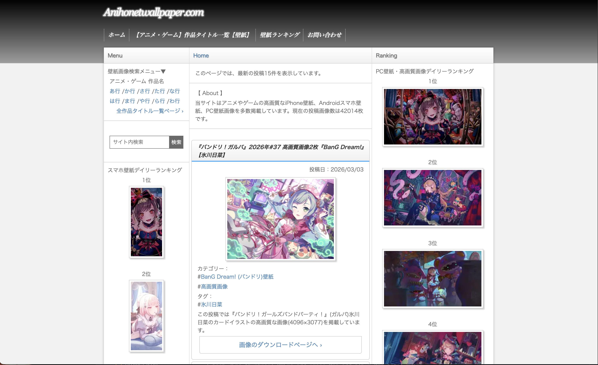
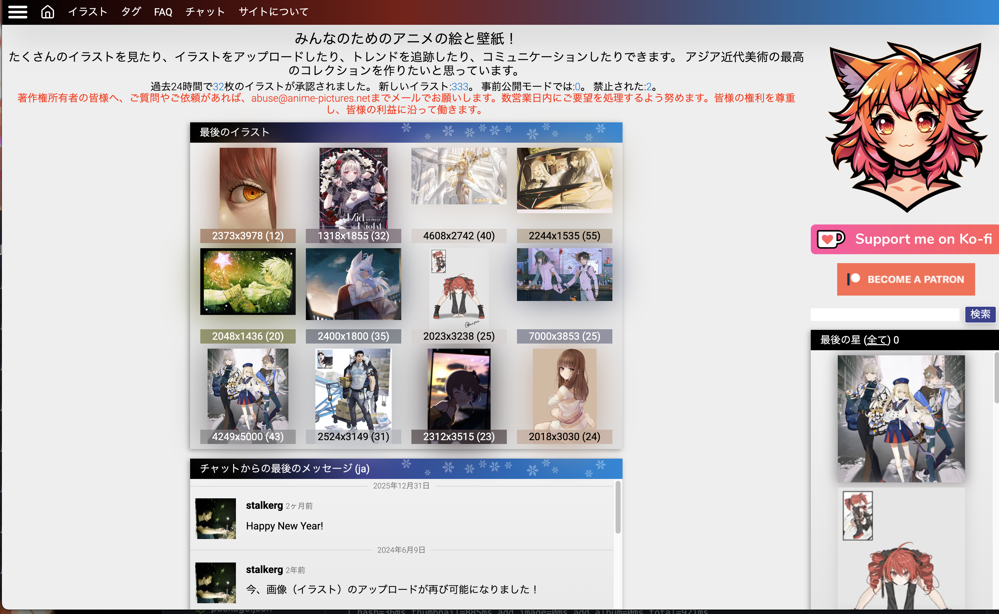
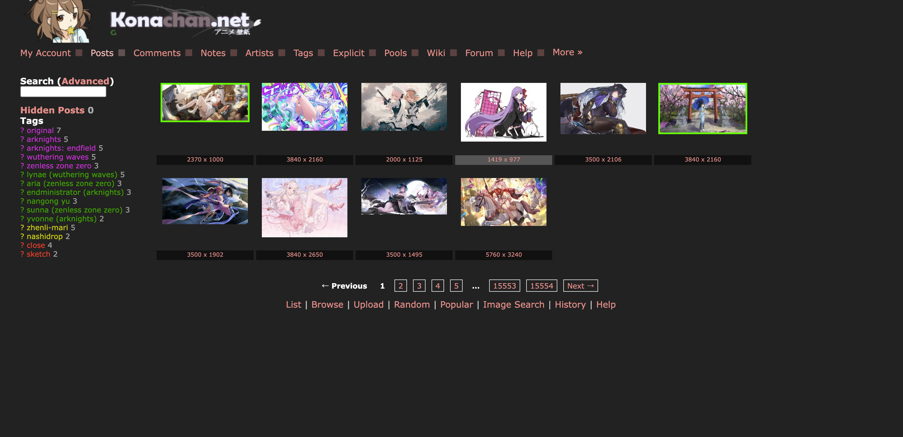
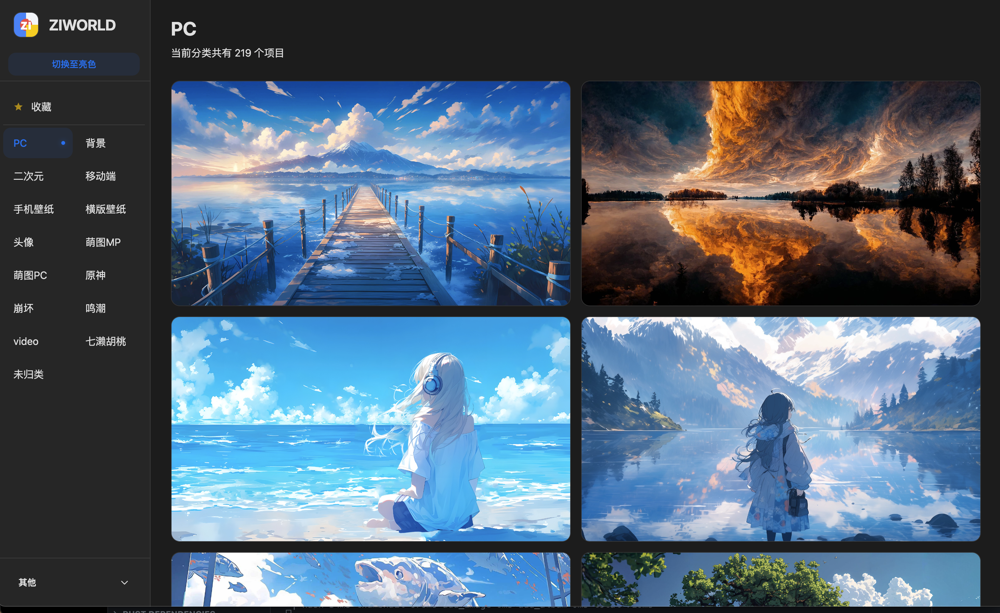

# Crawler Plugins

Kabegame 画像収集システム向けのクローラープラグインをまとめたリポジトリです。

## プラグイン一覧

### 1. anihonet-wallpaper

**名前**: anihonetアニメ壁紙  
**バージョン**: 1.1.4  
**説明**: anihonetアニメ壁紙収集プラグイン  
**作者**: Kabegame

**パス**: `plugins/anihonet-wallpaper/`  
**ドキュメント**: [plugins/anihonet-wallpaper/README.md](plugins/anihonet-wallpaper/README.md)

**機能**:
- anihonetwallpaper.com からアニメ壁紙を取得
- デスクトップ壁紙 / モバイル壁紙
- 日間・週間・月間・年間ランキング対応

**設定変数**:
- `start_page` / `end_page`: 開始ページ、終了ページ
- `wallpaper_type`: デスクトップ（imgpc）/ モバイル（sp）
- `ranking_period`: 日間（daily）/ 週間（weekly）/ 月間（monthly）/ 年間（annual）


---

### 2. anime-pictures

**名前**: anime-picturesアニメ図庫  
**バージョン**: 0.1.4  
**説明**: anime-picturesアニメ図庫収集プラグイン（タグ検索可）  
**作者**: Kabegame

**パス**: `plugins/anime-pictures/`  
**ユーザー向けドキュメント**: [plugins/anime-pictures/doc_root/doc.md](plugins/anime-pictures/doc_root/doc.md)

**機能**:
- [anime-pictures.net](https://anime-pictures.net) からタグ・ページ範囲で壁紙を一括取得
- サイトのタグでフィルター（キャラ名・作品名など）
- 1回あたり100ページ以内を推奨

**設定変数**:
- `startPage`: 開始ページ（0始まり）
- `endPage`: 終了ページ（そのページを含む）
- `tag`: サイト検索タグ。空欄の場合は現在のリストページを取得


---

### 3. konachan

**名前**: konachanアニメ壁紙  
**バージョン**: 1.0.4  
**説明**: konachanアニメ壁紙収集プラグイン  
**作者**: Kabegame

**パス**: `plugins/konachan/`

**機能**:
- konachan.net からアニメ壁紙を取得
- ページ範囲（開始ページ〜終了ページ）を指定可能
- 画質選択（高/中）
- 1回あたり最大100ページ（過負荷防止）

**設定変数**:
- `start_page`: 開始ページ（最小1）
- `end_page`: 終了ページ（1回あたり最大100ページ）
- `quality`: 画質（高/中）


---

### 4. ziworld

**名前**: ziworld高品質壁紙  
**バージョン**: 0.2.2  
**説明**: ziworld高品質壁紙収集プラグイン  
**作者**: Kabegame

**パス**: `plugins/ziworld/`  
**ユーザー向けドキュメント**: [plugins/ziworld/doc_root/doc.md](plugins/ziworld/doc_root/doc.md)

**機能**:
- [ziworld](https://t.ziworld.top/date.json) から壁紙を取得
- カテゴリ複数選択（PC、背景、アニメ、モバイル、原神、崩坏など）
- サイトに動画壁紙あり（ダウンロード非対応）

**設定変数**:
- `category`: カテゴリ複数選択（チェックボックス）。PC、背景、アニメ、モバイル、スマホ壁紙など


---

## 使い方

### Git Submodule として

このリポジトリはメインプロジェクトの Git submodule として利用します：

```bash
# submodule の初期化（初回クローン時）
git submodule update --init --recursive

# submodule を最新に更新
git submodule update --remote crawler-plugins

# 全 submodule を更新
git submodule update --remote
```

### プラグインのパッケージ

#### プラグインリポジトリ内で

プラグインを `.kgpg` 形式（ZIP）でパッケージします。

**依存関係のインストール**（初回）:

```bash
bun install
```

**全プラグインをパッケージ**（CLI のため kabegame メインプロジェクト内で実行する必要あり）:

```bash
bun run package
# または
node package-plugin.js
```

**出力先の指定**（任意）:

デフォルトは `crawler-plugins/packed/`。別ディレクトリへ出力する場合：

```bash
node package-plugin.js --outDir ../data/plugins-directory
```

**単一プラグインのパッケージ**:

```bash
node package-plugin.js <プラグイン名>
# 例:
node package-plugin.js anihonet-wallpaper
```

**指定プラグインのみパッケージ**（開発時の高速化）:

```bash
node package-plugin.js --only single-file-import local-folder-import
```

**プラグイン索引（index.json）の生成**:

```bash
pnpm run generate-index
```

**パッケージと索引の一括実行**:

```bash
pnpm run release
```

**新バージョンのリリース**:

1. `package.json` の `version` を更新
2. コミットして `main` にプッシュ
3. `pre-push` hook がパッケージ・索引生成・タグ作成を実行
4. GitHub Actions が Release を作成しアセットをアップロード

**Git Hooks**:

`pre-push` hook でパッケージ・索引生成・タグ作成が自動実行されます。有効化：

```bash
pnpm install
# または
pnpm prepare
```

#### メインプロジェクトから

メインプロジェクトのルートで：

```bash
pnpm run package-plugin crawler-plugins/plugins/<プラグイン名>
```

出力: `crawler-plugins/packed/<プラグイン名>.kgpg`

---

## 開発者向けドキュメント

### プラグイン開発ガイド

- プラグインのディレクトリ構成
- パッケージ方法
- ファイル形式（manifest.json、config.json、crawl.rhai）
- 変数タイプと設定

📖 [README_PLUGIN_DEV.md](README_PLUGIN_DEV.md)

### Rhai API

- ナビゲーション・取得（`to()`, `back()`, `fetch_json()`）
- ページ情報（`current_url()`, `current_html()`）
- DOM クエリ（`query()`, `get_attr()`, `query_by_text()`）
- URL・画像ヘルパー（`resolve_url()`, `is_image_url()`, `download_image()`）
- 例と注意事項

📖 [RHAI_API.md](RHAI_API.md)

---

## リポジトリ情報

**リモート**: git@github.com:kabegame/crawler-plugins.git  
**メインブランチ**: main

---

## 貢献

新しいプラグインや改善のプルリクを歓迎します。次の点を満たしてください：

1. 標準のプラグインファイル構成に従う
2. 完全な manifest.json を用意する
3. わかりやすい README.md とユーザー向け doc（doc_root/doc.md）を書く

開発前にメインリポジトリの [プラグイン開発ガイド](https://github.com/kabegame/kabegame/tree/main/docs/README_PLUGIN_DEV.md) と [Rhai API](https://github.com/kabegame/kabegame/tree/main/docs/RHAI_API.md) を参照してください。

---

*Generated by AI*
