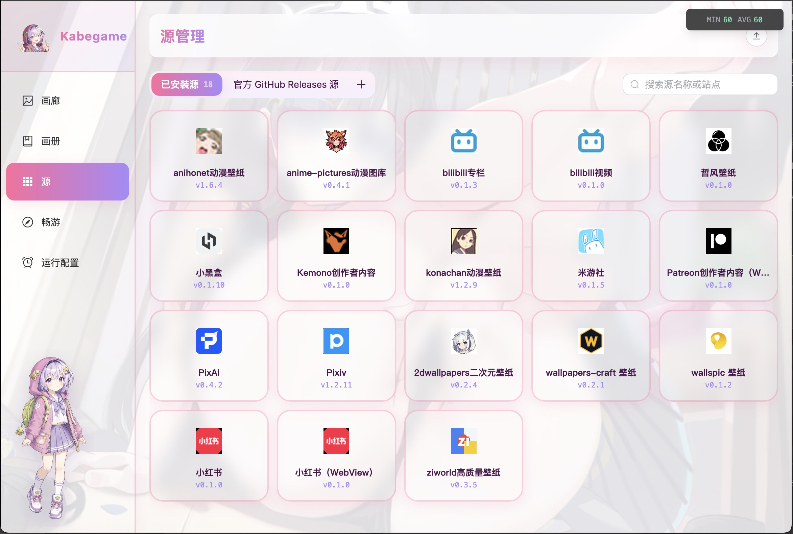

# Kabegame Crawler Plugins

Kabegame应用插件仓库，[Kabegame](https://github.com/kabegame/kabegame) 运行的爬图插件。

应用插件截图(v4.4.0) 

> [!NOTE]
> 以下有些插件需要登录态，但 Kabegame 处理登录态就像登录网站一样简单，你不需要做多于登录网站的事情（比如复制cookie之类的），直接在应用内 -> 畅游 -> 打开网站登录即可，kabegame会本地保存你的凭证，并在下图的时候自动注入！对于webview插件来说，还具备极高的反爬能力，因为它本身就是一个网页！

把散落在插画站、社区、壁纸站和创作者平台上的好内容，收进同一个 Kabegame 图库。

这个仓库目前包含 **22 个爬虫插件**。下面不讲繁琐配置，只回答两个问题：**它能帮你收什么，以及你是否需要它。**

> 插件只负责整理你有权访问的内容。使用时请遵守来源网站的服务条款，尊重作者版权与隐私，并合理控制抓取频率。

## 30 秒选到合适的插件

| 你想做什么 | 优先看看 | 为什么 |
| --- | --- | --- |
| 追 Pixiv 画师、榜单或收藏 | [Pixiv](#pixiv) | 排行榜、收藏、画师、关键词一站齐全 |
| 发掘高质量 AI 插画 | [PixAI](#pixai) | 能按作品、模型、LoRA、标签和作者一路深挖 |
| 精确收你推的角色或作品 | [anime-pictures](#anime-pictures)、[anihonet](#anihonet-wallpaper)、[2dwallpapers](#2dwallpapers) | 标签、作品分类和主题入口更直接 |
| 收原神、崩铁、绝区零等同人图 | [米游社](#米游社)、[Pixiv](#pixiv)、[ziworld](#ziworld) | 社区新图、专业插画和精选壁纸各有所长 |
| 从小红书保存图片、视频或 Live Photo | [小红书](#小红书怎么选) | 单作品/推荐用轻量版，作者/搜索/收藏用 WebView 版 |
| 从社区帖子连评论区一起收图 | [小黑盒](#小黑盒)、[米游社](#米游社) | 正文之外还能发现评论区里的隐藏好图 |
| 下载 B 站内容 | [bilibili 专栏](#bilibili-专栏)、[bilibili 视频](#bilibili-视频) | 图文收原图，视频收 MP4 |
| 整理自己订阅的创作者内容 | [Patreon](#patreonwebview)、[Kemono](#kemono) | 面向创作者帖子、图片和附件 |
| 找适配手机、桌面或特定分辨率的壁纸 | [WallpapersCraft](#wallpaperscraft)、[Wallspic](#wallspic)、[哲风壁纸](#哲风壁纸) | 分类完整，设备与尺寸筛选清楚 |
| 随便逛逛，让好图自己找上门 | [Konachan](#konachan)、[PixAI](#pixai)、[ziworld](#ziworld) | 标签池、趋势榜和精选目录都适合“淘图” |
| 收超高分辨率扫图做多屏壁纸 | [yande.re](#yandere)、[Konachan](#konachan) | 同一套 Moebooru，yande.re 偏向七八千像素的大图 |
| 攒一份带完整标签的图库（AI 生图素材） | [Danbooru](#danbooru)、[Gelbooru](#gelbooru) | 每张图都存下全量标签，详情页可一键复制成 prompt |
| 想知道每张图的原始出处在哪 | [Zerochan](#zerochan) | 人工整理的分类标签 + 原作发布页 URL，都存进元数据 |

## 插件全览

### 插画与二次元

#### Pixiv

**适合你，如果：** Pixiv 是你的主阵地，想把排行榜、**个人收藏**、**指定画师**或关键词搜索结果系统地收进图库。

它会下载作品原图，多页插画和漫画也能逐页保存；排行榜还覆盖原创、AI、新人、男性向与女性向等维度。部分模式可匿名使用，个人收藏和 R18 内容需要登录，通常也需要可访问 Pixiv 的网络环境。

[查看插件目录](plugins/pixiv/) · [使用说明](plugins/pixiv/README.md)

#### PixAI

**适合你，如果：** 你喜欢 AI 插画，或者想从一张好图继续追到它背后的模型、LoRA、标签和作者，以及一些精美的 AI 视频。每天固定更新新图不会厌倦。

除了全站趋势和作品榜，它还能浏览热门生成模型、按标签或作者收集，并支持动图内容。它的优势不是“再来一个图片站”，而是能沿着生成生态持续发现风格相近的作品；通常需要代理网络。

[查看插件目录](plugins/pixai/)

#### anime-pictures

**适合你，如果：** 你脑中已经有明确的角色名、作品名或标签，不想在泛搜索结果里慢慢筛。

anime-pictures 的标签体系很细，特别适合批量收某个角色、IP 或题材的高清动漫图。给它一个站内标签和页码范围，它就会进入详情页取大图；通常需要代理网络。

[查看插件目录](plugins/anime-pictures/) · [使用说明](plugins/anime-pictures/README.md)

#### Konachan

**适合你，如果：** 你喜欢 Danbooru 风格的标签检索，想按角色、作品、画师或风格批量淘二次元桌面壁纸。

既可以直接抓图片，也可以先浏览热门标签，再组合标签缩小范围；同时提供大众站与 R18 站入口，并可选择图片质量。站内可能出现成人内容，通常需要代理网络，请按自身需求和所在地规则使用。

[查看插件目录](plugins/konachan/) · [使用说明](plugins/konachan/README.md)

#### Danbooru

**适合你，如果：** 你要的不只是图，还有**图上的标签**——想攒一份能直接喂给 AI 生图的素材库，或者靠标签把图库切得很细。

它把详情页的全量标签写进每张图的元数据：按 作家 / 版权 / 角色 / 通用 / 元信息 分好类，图片详情侧栏一键复制成 prompt；画廊里还能按「标签分类 → 标签」两级浏览已下载的图。抓取上支持标签组合、日/周/月人气榜、全站最新和「先浏览标签表再逐个标签抓」四种模式，可切全站或全年龄镜像，质量可选原图直链或站点 sample。注意站点对未登录/普通账号限制每次检索最多 2 个标签；站内有成人内容，通常需要代理网络。

[查看插件目录](plugins/danbooru/) · [使用说明](plugins/danbooru/README.md)

#### Gelbooru

**适合你，如果：** 你想要 Danbooru 那套标签体系，但不想被「未登录只能检索 2 个标签」卡住，或者单纯想换一个收录口味不同的大站。

它同样把详情页的全量标签写进每张图的元数据（作家 / 角色 / 版权 / 元信息 / 通用），图片详情侧栏按站点原样的配色渲染，可一键复制成 prompt，画廊里也能按「标签分类 → 标签」两级浏览。抓取支持标签组合、全站最新和「先浏览标签表再逐个标签抓」三种模式，排序可选最新 / 高分 / 最近更新 / 随机，质量可选原图直链或站点 sample，视频帖直接取原 mp4。注意站点每页固定 42 张（未登录时无法调整）；站内有成人内容，通常需要代理网络。

[查看插件目录](plugins/gelbooru/) · [使用说明](plugins/gelbooru/README.md)

#### yande.re

**适合你，如果：** 你要的是**大图**——七八千像素、几十 MB 的高清扫图和插画，用来做多屏或高分屏壁纸。

站点和 Konachan 是同一套程序（Moebooru），标签检索的手感一致，但收录偏向高分辨率扫图。抓取支持全站最新、标签组合和「先浏览标签表再逐个标签抓」三种模式，可按分级（全年龄 / 存疑 / 限制级）过滤，排序可选最新 / 高分 / 分辨率 / 随机，质量可选原文件直链或站点 sample。元数据除了侧栏标签、统计信息和相关作品，**还会还原详情页下方的评论区**（作者、头像、时间、正文），在图片详情侧栏一并渲染；画廊里可按「标签类型 → 标签」两级浏览。站内成人内容与全年龄内容混排，通常需要代理网络。

[查看插件目录](plugins/yandere/) · [使用说明](plugins/yandere/README.md)

#### Zerochan

**适合你，如果：** 你在意的不只是图，还有**这张图是谁画的、出自哪部作品、原本发在哪**——想要一份来源清楚、标签规整的图库。

Zerochan 的标签是人工整理的，每个标签都分了类（画师 / 作品 / 角色 / 主题 / 来源）并记着是谁加的；每张图还带一条原作发布页 URL（Pixiv、Twitter、DeviantArt……）。插件把这些连同分享文本和收藏统计一起写进元数据，图片详情侧栏按站点原样的配色和图标还原出右侧栏，区块文案跟随应用语言。抓取支持浏览全站、单个站内标签和任意关键词搜索三种模式，都可按最新或人气排序，质量可选原图直链或站点 1024px 预览。站点有一道 bot 校验，插件会自动通过；未登录时每页看不全，通常需要代理网络。

[查看插件目录](plugins/zerochan/) · [使用说明](plugins/zerochan/README.md)

#### anihonet-wallpaper

**适合你，如果：** 你想要的是“拿来就能用”的动漫/游戏壁纸，而不是从海量插画里自己判断尺寸。

可以追日榜、周榜、月榜和年榜，也能从庞大的作品列表中直达某部动画或游戏，或按主题关键词寻找壁纸。手机与桌面壁纸都有，特别适合定期补充轮播图库。

[查看插件目录](plugins/anihonet-wallpaper/) · [使用说明](plugins/anihonet-wallpaper/README.md)

#### 2dwallpapers

**适合你，如果：** 你只想围绕某一部动漫或游戏找壁纸，并希望按热度、收藏或新旧程度筛选。

输入部分作品名即可匹配站内游戏/动漫分类，例如 Genshin 或 Honkai；也能浏览未分类作品。比全站漫游更聚焦，很适合给某个主题单独建相册。

[查看插件目录](plugins/twodwallpapers/) · [使用说明](plugins/twodwallpapers/README.md)

### 社区、帖子与创作者

#### 米游社

**适合你，如果：** 你关注原神、崩坏系列、星穹铁道、绝区零等米哈游游戏的同人图、壁纸、COS和社区作者。

支持关键词搜索、单帖链接和作者主页三种入口，正文图片会完整收集，还能选择把评论区配图一起带走。相比通用插画站，它更接近玩家社区里正在流行的内容。

[查看插件目录](plugins/miyoushe/) · [使用说明](plugins/miyoushe/README.md)

#### bilibili 专栏

**适合你，如果：** 你经常在 B 站专栏或图文帖里看到图集、教程配图、画师整理，却不想逐张另存。

可以按关键词批量搜索专栏，也可以只处理一个 `cv` 专栏或 Opus 链接，并保留标题等来源信息。关键词搜索和传统专栏依赖 B 站登录态，Opus 单帖通常更轻量。

[查看插件目录](plugins/bilibili/) · [使用说明](plugins/bilibili/README.md)

#### 小黑盒

**适合你，如果：** 你想收藏游戏社区里的壁纸、摄影、Cosplay 或玩家自制图，尤其不想漏掉评论区。

既能按关键词找帖，也能精准处理一条分享链接；正文和评论区图片都可以收。单帖链接更准、也更不容易触发风控；批量搜索时使用登录态通常更稳定。

[查看插件目录](plugins/heybox/) · [使用说明](plugins/heybox/README.md)

#### 小红书：怎么选

两个插件下载的都可以是原图、视频和 Live Photo，区别在于“轻便”还是“覆盖面”：

| 插件 | 最适合 | 取舍 |
| --- | --- | --- |
| **小红书（V8）** | 已知作品链接、首页推荐流 | 不弹浏览器，简单轻量；不支持作者、搜索、专辑、收藏和点赞 |
| **小红书（WebView）** | 作者主页、搜索、专辑、收藏、点赞 | 能滚动真实网页、复用登录并处理验证码；运行时会使用浏览器窗口 |

##### 小红书（V8）

**适合你，如果：** 你只需要保存几个分享链接，或想定期收首页推荐，不需要复杂检索。

支持小红书详情链接和短链；登录后推荐流会更贴近你的兴趣，未登录也能使用通用推荐。它不会绕过站点签名或访问控制，因此能力边界清晰、运行也更轻。

[查看插件目录](plugins/xhs/) · [使用说明](plugins/xhs/README.md)

##### 小红书（WebView）

**适合你，如果：** 你需要按作者、搜索词、专辑/画板、收藏或点赞列表收集，轻量版覆盖不了你的场景。

它在真实网页中滚动加载并逐条进入详情，能沿用畅游里的登录状态；遇到登录或验证码时也可以直接在窗口内完成。收藏和点赞等私人列表需要对应账号本来就有访问权限。

[查看插件目录](plugins/xhs-webview/) · [使用说明](plugins/xhs-webview/README.md)

#### Kemono

**适合你，如果：** 你需要整理 Kemono 上的创作者帖子与附件，并希望按作者、收藏或标签连续归档。

支持 Patreon、Fanbox、Fantia、Afdian 等多种来源，也能处理单帖链接。默认使用较稳定的 800px 缩略图；原图节点在许多网络环境中不可达。站内可能包含成人内容，收藏模式需要先登录。

[查看插件目录](plugins/kemono/) · [使用说明](plugins/kemono/README.md)

#### Patreon（WebView）

**适合你，如果：** 你已经订阅了 Patreon 创作者，想把自己有权查看的帖子图片和压缩包附件整理进 Kabegame。

真实浏览器后端可以通过 Patreon 的正常登录与 Cloudflare 检查，并把 ZIP、7z、tar 等压缩包中的图片逐张入库。它不会绕订阅墙或 DRM，也不处理 Patreon 视频；只能下载当前账号本来就能访问的内容。

[查看插件目录](plugins/patreon-webview/) · [使用说明](plugins/patreon-webview/README.md)

### 视频

#### bilibili 视频

**适合你，如果：** 你想把普通 B 站投稿保存为可管理、可播放的本地 MP4。

支持 BV/av 号或链接、UP 主投稿、合集/系列、收藏夹以及关键词搜索；分离的音视频流会自动合流。登录后画质更稳定，大会员可获取账号有权播放的 4K/HDR；合流依赖 FFmpeg，目前不支持 Android，也不支持番剧、课程和直播。

[查看插件目录](plugins/bilibili-video/) · [使用说明](plugins/bilibili-video/README.md)

### 综合壁纸站

#### 哲风壁纸

**适合你，如果：** 你想在一个中文壁纸站里同时找桌面图、手机图和动态视频壁纸。

可按图片/视频、设备类型和标签缩小范围，详情元数据里还会保留作者、色系、分辨率等信息。插件获取的是站点可直接访问的预览资源，而不是需要登录的原图端点。

[查看插件目录](plugins/haowallpaper/) · [使用说明](plugins/haowallpaper/README.md)

#### ziworld

**适合你，如果：** 你偏爱整理好的中文精选壁纸包，想少筛选、多收图。

目录覆盖 PC、手机、横屏、头像、二次元、原神、崩坏、鸣潮和视频壁纸等，一次可选多个主题。站点更新不算频繁，但内容精致，很适合快速搭一套基础图库。

[查看插件目录](plugins/ziworld/) · [使用说明](plugins/ziworld/README.md)

#### WallpapersCraft

**适合你，如果：** 你需要一个题材覆盖广、分辨率选择细的通用壁纸来源。

动漫、自然、城市、汽车、极简、科技等目录一应俱全，也能按标签、热度、日期和具体分辨率筛选。尤其适合明确知道屏幕尺寸，希望下载后无需再裁切的人。

[查看插件目录](plugins/wallpapers-craft/) · [使用说明](plugins/wallpapers-craft/README.md)

#### Wallspic

**适合你，如果：** 你想按专辑或标签浏览综合壁纸，同时快速切换手机、桌面、4K/8K 或具体设备尺寸。

它和 WallpapersCraft 都适合通用壁纸，但 Wallspic 更强调专辑、热门排序和设备预设；iPhone、Android、宽屏与 Ultra HD 都有现成入口。

[查看插件目录](plugins/wallspic/) · [使用说明](plugins/wallspic/README.md)

找不到想要的插件？请提一个issue吧，或者等待将来陆续推出！

## 给使用者的几个提醒

- **登录不是解锁器。** 插件只会使用你自己的正常登录权限，不会绕过付费墙、验证码、DRM 或私密内容。
- **代理取决于来源站点。** Pixiv、PixAI、anime-pictures、Konachan、yande.re、Danbooru、Gelbooru 等是否可访问，取决于你所在地区和网络环境。
- **先小范围试跑。** 社区和创作者平台容易触发限流，视频与压缩包也可能迅速占满磁盘。
- **成人内容要主动留意。** Konachan、yande.re、Danbooru、Gelbooru、Kemono、Patreon 等来源可能出现成人内容，请遵守所在地法律并做好图库分级。
- 每个插件的完整配置、登录方式和限制都在对应的 **使用说明** 中；这里刻意只保留选型需要的信息。

## 仓库开发

每个插件都位于 `plugins/<插件名>/`，入口与元数据以插件自己的 `package.json` 为准，用户文档位于 `README.md`。

首次安装依赖：

```bash
pnpm install
```

打包全部插件：

```bash
pnpm run package
```

打包单个插件：

```bash
pnpm run package -- pixiv
```

打包产物默认写入 `packed/`。打包工具依赖 Kabegame 主仓库构建出的 `kabegame-cli`，因此通常需要把本仓库放在 Kabegame 主项目中使用。

生成发布索引，或一键打包并生成索引：

```bash
pnpm run generate-index
pnpm run release
```

欢迎提交新插件、修复现有来源，或改进用户文档。开发前请阅读 Kabegame 主仓库中的 [插件开发指南](https://github.com/kabegame/kabegame/tree/main/docs/README_PLUGIN_DEV.md) 与 [API 文档](https://github.com/kabegame/kabegame/tree/main/docs/RHAI_API.md)。
