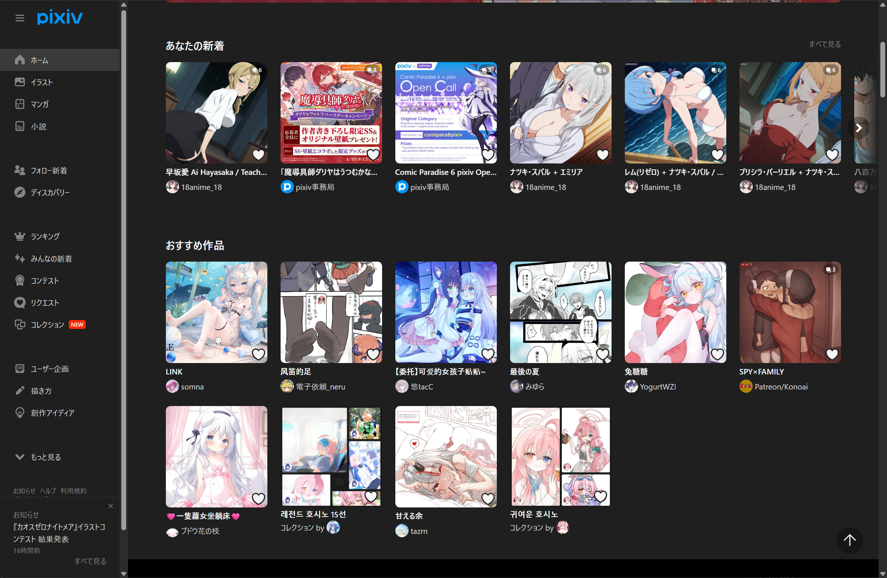

# Crawler Plugins

这是一个包含各种爬虫插件的仓库，用于 Kabegame 图片收集系统。

## 插件列表

### 1. anihonet-wallpaper

**名称**: anihonet动漫壁纸  
**版本**: 1.1.1  
**描述**: anihonet动漫壁纸收集源插件  
**作者**: 程闽

**路径**: `plugins/anihonet-wallpaper/`  
**详细文档**: [plugins/anihonet-wallpaper/README.md](plugins/anihonet-wallpaper/README.md)

**功能**:
- 从 anihonetwallpaper.com 爬取动漫壁纸
- 支持桌面壁纸 / 手机壁纸类型
- 支持日榜、周榜、月榜、年榜

**配置变量**:
- `start_page` / `end_page`：起始页、结束页
- `wallpaper_type`：桌面壁纸（imgpc）/ 手机壁纸（sp）
- `ranking_period`：日榜（daily）/ 周榜（weekly）/ 月榜（monthly）/ 年榜（annual）


---

### 2. anime-pictures

**名称**: anime-pictures动漫图库  
**版本**: 0.1.0  
**描述**: anime-pictures动漫图库收集源插件（可按标签检索）  
**作者**: Kabegame

**路径**: `plugins/anime-pictures/`  
**用户文档**: [plugins/anime-pictures/doc_root/doc.md](plugins/anime-pictures/doc_root/doc.md)

**功能**:
- 从 [anime-pictures.net](https://anime-pictures.net) 按标签与页面范围批量下载壁纸
- 支持按站点标签筛选（如角色名、作品名）
- 单次任务建议不超过 100 页

**配置变量**:
- `startPage`：起始页面（从 0 开始）
- `endPage`：结束页数（包含该页）
- `tag`：站点搜索标签，留空则按当前列表页爬取


---

### 3. konachan

**名称**: konachan动漫壁纸  
**版本**: 1.0.1  
**描述**: konachan动漫壁纸收集源插件  
**作者**: 程闽

**路径**: `plugins/konachan/`

**功能**:
- 从 `konachan.net` 网站爬取动漫壁纸
- 支持选择页面范围（起始页面到结束页面）
- 支持选择图片质量（高/中）
- 一次最多爬取 100 页（防止过度爬取）

**配置变量**:
- `start_page`：起始页面（最小值为 1）
- `end_page`：结束页面（一次最多爬取 100 页）
- `quality`：图片质量（高/中）


---

### 4. ziworld

**名称**: ziworld高质量壁纸  
**版本**: 0.1.0  
**描述**: ziworld高质量壁纸收集源插件  
**作者**: Kabegame

**路径**: `plugins/ziworld/`  
**用户文档**: [plugins/ziworld/doc_root/doc.md](plugins/ziworld/doc_root/doc.md)

**功能**:
- 从 [ziworld](https://t.ziworld.top/date.json) 抓取图片壁纸
- 按目录多选拉取（如 PC、背景、二次元、移动端、原神、崩坏等）
- 站点有视频壁纸，但不支持下载

**配置变量**:
- `category`：目录多选（checkbox），勾选要拉取的目录。可选值包括：PC、背景、二次元、移动端、手机壁纸、横版壁纸、头像、萌图MP、萌图PC、原神、崩坏、鸣潮、七濑胡桃、未归类等


---

### 5. pixiv

**名称**: Pixiv  
**版本**: 1.0.1  
**描述**: Pixiv 插画爬虫：排行榜、收藏、画师、关键词  
**作者**: Kabegame

**路径**: `plugins/pixiv/`  
**用户文档**: [plugins/pixiv/doc_root/doc.md](plugins/pixiv/doc_root/doc.md)

**功能**:
- 从 [pixiv.net](https://www.pixiv.net) 爬取插画，支持四种模式：排行榜、个人收藏、画师作品、关键词搜索
- 排行榜支持日/周/月榜、男性向/女性向、AI 日榜及 R18 等类型
- 关键词支持高级搜索语法（如 `(Lucy OR 边缘行者) AND 5000users`）
- 部分模式需在「高级设置 → HTTP 头」中配置 Cookie，详见用户文档

**配置变量**:
- `source`：爬取类型（排行榜 / 个人收藏 / 画师作品 / 关键词搜索）
- `user_id`：用户 UID（收藏、画师等模式）
- `ranking_mode`：排行榜类型（日榜、周榜、月榜、男性向、女性向、AI 日榜及 R18 等）
- `content_mode`：内容类型（全部 / 插画 / 漫画 / 动图，仅部分排行榜）
- `start_date` / `date_range`：起始日期（YYYYMMDD）、日期范围（天）
- `artist_id`：画师 UID（画师作品模式）
- `keyword` / `search_mode` / `keyword_order`：关键词、搜索模式（安全/R18/全部）、排序方式
- `num_images`：最大下载数（1～1000）


---

### 6. twodwallpapers

**名称**: 2dwallpapers二次元壁纸  
**版本**: 0.1.0  
**描述**: 2dwallpapers 壁纸网站爬虫  
**作者**: Kabegame

**路径**: `plugins/twodwallpapers/`  
**用户文档**: [plugins/twodwallpapers/doc_root/doc.md](plugins/twodwallpapers/doc_root/doc.md)

**功能**:
- 从 [2dwallpapers.com](https://2dwallpapers.com) 爬取动漫、游戏等二次元壁纸
- 支持大目录（动漫壁纸 / 游戏壁纸 / 未分类）与子目录关键字过滤
- 支持多种排序：最新、最多查看、最多喜欢、最多收藏、最近更新、随机

**配置变量**:
- `category`：大目录（动漫壁纸 / 游戏壁纸 / 未分类）
- `sub_cate_key`：子目录关键字（可选，按名称过滤子分类，支持正则如 `Genshin|Honkai`）
- `max_num`：爬取总数（1～1000）
- `orderby`：排序方式（最新 / 最多查看 / 最多喜欢 / 最多收藏 / 最近更新 / 随机）


---

## 使用方法

### 作为 Git Submodule

这个仓库作为主项目的 Git Submodule 使用：

```bash
# 初始化 submodule（首次克隆主项目时）
git submodule update --init --recursive

# 更新 submodule 到最新版本
git submodule update --remote crawler-plugins

# 更新所有 submodules
git submodule update --remote
```

### 打包插件

#### 在插件仓库中打包

本仓库提供了打包工具，可以将插件打包为 `.kgpg` 格式（ZIP 压缩格式）。

**安装依赖**（首次使用）：

```bash
bun install
```

**打包所有插件**（注意必须要包含在kabegame主项目中，否则没有cli无法打包）

```bash
bun run package
# 或
node package-plugin.js
```

**指定输出目录（可选）**：

默认输出到 `crawler-plugins/packed/`。如果你希望把 `.kgpg` 直接输出到其它目录（例如主仓库开发模式的 `data/plugins-directory/`），可以使用 `--outDir`：

```bash
# 输出到 <repo>/data/plugins-directory
node package-plugin.js --outDir ../data/plugins-directory
```

**打包单个插件**：

```bash
node package-plugin.js <插件名称>
# 例如：
node package-plugin.js anihonet-wallpaper
```

**打包单个插件并指定输出目录（可选）**：

```bash
node package-plugin.js anihonet-wallpaper --outDir ../data/plugins-directory
```

**仅打包指定插件（多选，用于开发提速）**：

```bash
# 只打包这两个插件，并清理 packed 目录下其它 .kgpg（避免开发模式下被应用加载到）
node package-plugin.js --only single-file-import local-folder-import

# 也支持逗号分隔
node package-plugin.js --only single-file-import,local-folder-import
```

**仅打包指定插件并指定输出目录（可选）**：

```bash
node package-plugin.js --only single-file-import local-folder-import --outDir ../data/plugins-directory
```

打包后的文件将生成在 `packed/<插件名称>.kgpg` 目录中。

**生成插件索引文件（index.json）**：

索引文件用于 GitHub Release，包含所有插件的下载链接和元数据。版本信息自动从 `package.json` 读取。

```bash
# 生成索引文件（版本从 package.json 读取）
pnpm run generate-index

# 手动指定仓库信息（可选）
node generate-index.js kabegame crawler-plugins
```

生成的 `index.json` 将保存在 `packed/index.json`，格式符合后端期望：
- 版本信息从 `package.json` 的 `version` 字段读取，自动添加 `v` 前缀（如 `1.0.0` → `v1.0.0`）
- 使用 camelCase 字段名（`downloadUrl`, `sizeBytes`）
- 包含 SHA256 校验和
- 下载 URL 指向 GitHub Release：`https://github.com/kabegame/crawler-plugins/releases/download/{tag}/{plugin}.kgpg`
- 图标：KGPG v2 已将列表图标写入 `.kgpg` 固定头部，可通过 HTTP Range 直接读取；`index.json` 不再需要 `iconUrl`，也不再生成 `packed/<plugin>.icon.png`

**一键打包并生成索引**：

```bash
pnpm run release
```

这将先打包所有插件，然后生成索引文件。

**发布新版本**：

1. 更新 `package.json` 中的 `version` 字段（如 `1.0.0` → `1.1.0`）
2. 提交更改并推送到 `main` 分支
3. `pre-push` hook 会自动：
   - 打包所有插件（生成 `.kgpg` 文件）
   - 生成 `index.json`
   - 如果 `packed/` 有更改，自动提交
   - 创建 tag（格式：`v{version}`）并推送
4. GitHub Actions 会自动：
   - 验证 `packed/` 目录下的文件
   - 创建 GitHub Release 并上传文件

如果 tag 已存在，会跳过创建以避免重复。

**Git Hooks（自动打包 + 打 tag）**：

本仓库配置了 `pre-push` git hook，在 `git push` 前会自动：
1. 打包所有插件并生成 `index.json`
2. 如果 `packed/` 有更改，自动提交
3. 根据 `package.json` 的版本创建 tag（格式：`v{version}`）

所有操作都是非阻塞的，失败不会阻断 push。

首次使用需要启用 hooks：

```bash
# 安装依赖（会自动运行 prepare 脚本安装 husky）
pnpm install
# 或手动运行
pnpm prepare
```

之后每次 `git push` 时，hook 会自动执行打包、生成索引、提交和创建 tag。

#### 在主项目中使用

在主项目根目录执行：

```bash
pnpm run package-plugin crawler-plugins/plugins/<插件名称>
```

打包后的文件将生成在 `crawler-plugins/packed/<插件名称>.kgpg`

---

## 开发文档

### 插件开发指南

详细的插件开发指南，包括：
- 插件目录结构
- 打包插件的方法
- 插件文件格式说明（manifest.json、config.json、crawl.rhai）
- 变量类型和配置说明

📖 [README_PLUGIN_DEV.md](README_PLUGIN_DEV.md)

### Rhai API 文档

完整的 Rhai 爬虫 API 参考文档，包括：
- 页面导航函数（`to()`, `back()`）与数据拉取（`fetch_json()`）
- 页面信息函数（`current_url()`, `current_html()`）
- 元素查询函数（`query()`, `get_attr()`, `query_by_text()`）
- URL 处理函数（`resolve_url()`, `is_image_url()`）
- 图片处理函数（`download_image()`）
- 完整示例和注意事项

📖 [RHAI_API.md](RHAI_API.md)

---

## 仓库信息

**远程仓库**: git@github.com:kabegame/crawler-plugins.git  
**主分支**: main

---

## 贡献

欢迎提交新的插件或改进现有插件。请确保：

1. 遵循插件的标准文件结构
2. 提供完整的 manifest.json 配置
3. 编写清晰的 README.md 文档
4. 包含用户文档（doc_root/doc.md）

开发新插件前，请先阅读kabegame仓库的 [插件开发指南](https://github.com/kabegame/kabegame/tree/main/docs/README_PLUGIN_DEV.md) 和 [Rhai API 文档](https://github.com/kabegame/kabegame/tree/main/docs/RHAI_API.md)。

