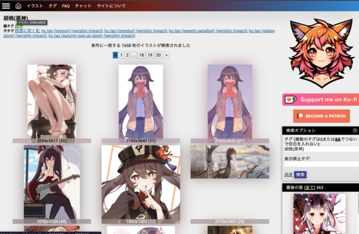

# anime-pictures Plugin Guide

Download wallpapers from [anime-pictures.net](https://anime-pictures.net) by tag and page range.

## Download by tag

1. **Open task config**  
   In Kabegame, create or edit a crawl task and choose source **anime-pictures**.

2. **Set parameters**

   | Parameter   | Description |
   |-------------|-------------|
   | **Start page** | First page to crawl (0-based). |
   | **End page**   | Last page to crawl (inclusive). Keep under 100 pages per task. |
   | **Tag**        | Site search tag; only images with this tag are downloaded. Leave empty to crawl the current list without a tag filter. |

3. **Finding tag names**  
   On [anime-pictures.net](https://anime-pictures.net), open an image you like.

The top-left area shows tags (e.g. "原神", "胡桃(原神)"). Pick one you want.

Enter that tag (e.g. "胡桃(原神)") in the plugin, set start/end pages, and run.

4. **Examples**

   - Genshin-related only, pages 1–5: **Start** `1`, **End** `5`, **Tag** `原神` or `Genshin Impact` (as on the site).
   - One character (e.g. コロンビーナ): **Tag** `コロンビーナ(原神)` (use the exact site tag).
   - No tag, just pages: Leave **Tag** empty and set start/end.

5. **Run**  
   Save and run; the plugin will open list pages in order, then each image page to download the full-size image. Progress updates as images are processed.

## Support the author

If you like the site, consider supporting the author:  
[Support him on ko-fi](https://ko-fi.com/P5P8L7EKH)

## Notes

- Keep start–end within 100 pages per task.
- End page must be ≥ start page.
- Tag must match the site exactly (language, parentheses, etc.) or you may get no results.

楽しんで〜

