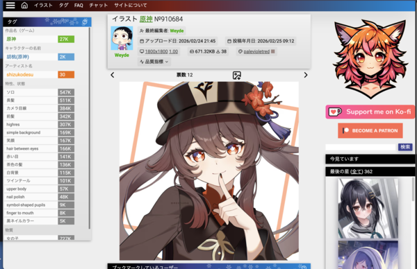

# anime-pictures 外掛說明

從 [anime-pictures.net](https://anime-pictures.net) 依標籤與頁面範圍批次下載壁紙。

## 依標籤下載想要的圖片

1. **開啟任務設定**  
   在 Kabegame 中新增或編輯「爬取任務」，選擇源為 **anime-pictures**。

2. **填寫參數**

   | 參數       | 說明 |
   |------------|------|
   | **起始頁面** | 從第幾頁開始爬（從 0 開始）。 |
   | **結束頁數** | 爬到第幾頁為止（含該頁）。單次建議不超過 100 頁。 |
   | **標籤**     | 站點搜尋標籤，只下載帶該標籤的圖片；留空則依目前列表頁爬取。 |

3. **取得標籤名**  
   在 [anime-pictures.net](https://anime-pictures.net) 找到喜歡的圖片，左上角會顯示標籤（如「原神」、「胡桃(原神)」）。選一個填入**標籤**，再設起始/結束頁數即可。

4. **範例**

   - 只下載「原神」相關圖第 1～5 页：**起始頁面** `1`，**結束頁數** `5`，**標籤** `原神` 或 `Genshin Impact`。
   - 只下載某角色（如 コロンビーナ）：**標籤** `コロンビーナ(原神)`（以站點實際標籤為準）。
   - 不依標籤、只依頁數：**標籤**留空，設定起始與結束頁數即可。

5. **執行任務**  
   儲存後執行，外掛會依頁序開啟列表、進入每張圖並下載大圖；進度會隨已處理數量更新。

## 作者支持
若喜歡此站作品，可在此支持作者：  
[Support him on ko-fi](https://ko-fi.com/P5P8L7EKH)

## 注意事項

- 單次任務起始到結束不超過 100 頁。
- 結束頁不可小於起始頁。
- 標籤需與站點一致（含語言、括號等），否則可能無結果。

楽しんで〜

