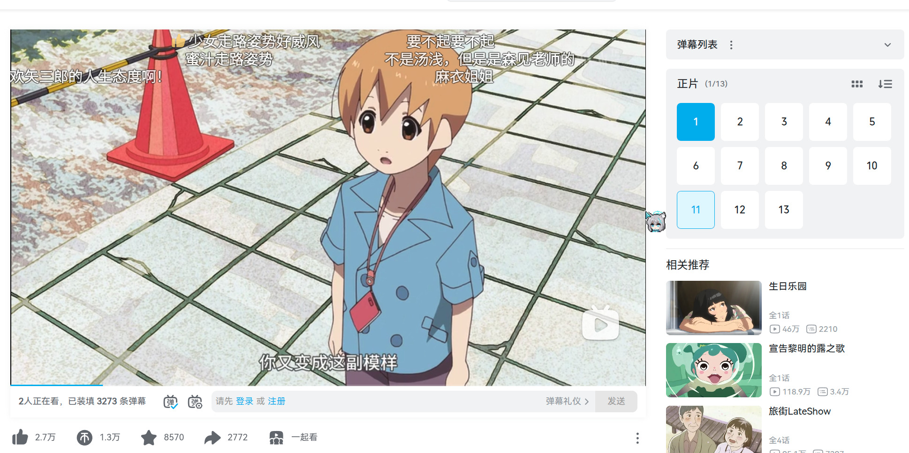
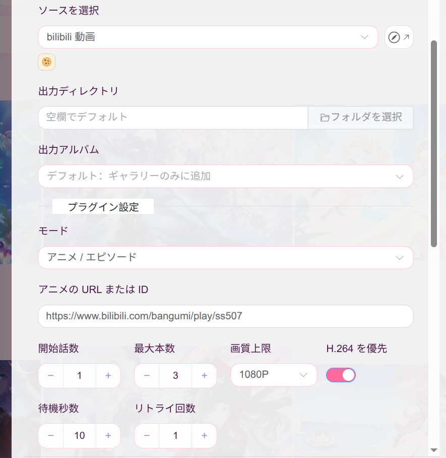
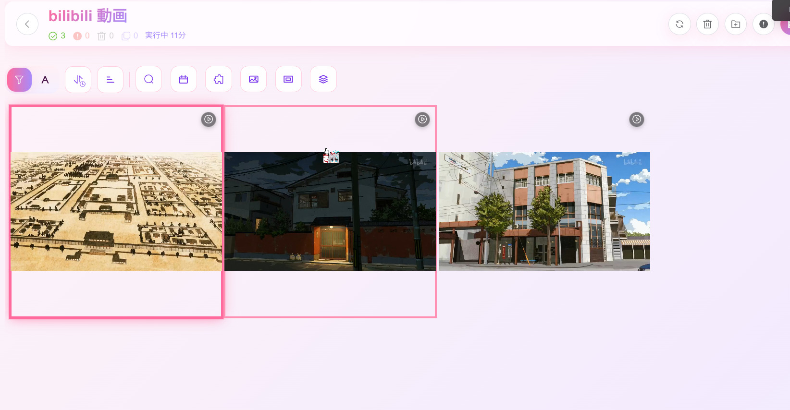

# bilibili 视频

下载 bilibili 视频。音视频分离流分块拉取后合流为 MP4 入库。

## 使用示例：下载番剧

下面以下载《有顶天家族》第一季（`ss507`）的前 3 集为例。

1. 在 bilibili 打开要下载的番剧，确认右侧「正片」列表中包含目标剧集。复制浏览器地址栏里的
   番剧链接；本例使用 [https://www.bilibili.com/bangumi/play/ss507](https://www.bilibili.com/bangumi/play/ss507)。

   

2. 在 Kabegame 新建下载任务，来源选择「bilibili 视频」，然后填写插件设置：

   - 「模式」选择「番剧 / 剧集」；
   - 「番剧链接或编号」粘贴完整链接，也可以只填 `ss507`；
   - 「起始集数」填 `1`，「最多下载数」填 `3`，表示从正片第 1 集开始下载 3 集；
   - 「画质上限」选择 `1080P`，保持「优先 H.264」开启，以获得更好的播放兼容性；
   - 「间隔秒数」和「重试次数」可先保持默认值 `10` 和 `1`。

   输出目录与输出相册按需选择；留空时使用 Kabegame 的默认位置。

   

3. 启动任务。插件会读取番剧的正片列表，依次下载前 3 集，将分离的音视频流合并为 MP4，
   再添加到画廊。任务完成后，可以在来源页面看到已下载的 3 个视频。

   

4. 点击任意视频即可查看详情并直接播放。若视频只有缩略图、无法播放，请确认下载时已开启
   「优先 H.264」；HEVC 或 AV1 的支持情况取决于当前平台。

   

## 模式

### 单个视频

在「视频 ID 或链接」里填以下任一形式：

- `BV13x41117TL`
- `av1074402`
- `https://www.bilibili.com/video/BV13x41117TL`

多分 P 的视频用「分 P 序号」选择第几 P，填 `0` 下载全部分 P。

### UP 主投稿

在「UP 主 UID 或主页链接」里填 UID（`3985676`）或主页链接
（`https://space.bilibili.com/3985676`）。列表每页 30 个投稿，用「起始页 / 结束页」翻页。

**「最多下载数」默认 5**，这是刻意保守的：一页 30 个视频，1080P 每个上百 MB，
一页就可能好几个 GB。确认好再往上调。

该模式**固定只取每个稿件的 P1**，否则一个 23 P 的稿件会一次炸出 23 个文件。

### 合集 / 系列 / 收藏夹

在「列表页链接」里粘贴完整链接，**类型自动识别**：

| 类型 | 链接形态 |
| --- | --- |
| 合集 | `space.bilibili.com/<UID>/lists/<ID>`（或 `?type=season`） |
| 合集（旧版） | `space.bilibili.com/<UID>/channel/collectiondetail?sid=<ID>` |
| 系列 | `space.bilibili.com/<UID>/lists/<ID>?type=series` |
| 系列（旧版） | `space.bilibili.com/<UID>/channel/seriesdetail?sid=<ID>` |
| 收藏夹 | `space.bilibili.com/<UID>/favlist?fid=<ID>` |
| 收藏夹（短链） | `bilibili.com/medialist/detail/ml<ID>` |

合集与系列必须是**完整的 space 链接**——接口要求同时提供 UP 主 UID 和列表 ID，只填 ID 无法请求。

收藏夹的条目接口一次返回全部内容、不分页，因此这里用「起始页」按每页 30 换算成起始位置，
再按「最多下载数」截断。收藏夹里的非视频条目（音频、专栏等）会被跳过并给出提示；
私密收藏夹需要以**所有者身份**登录畅游。

该模式同样固定只取每个稿件的 P1。

### 关键词搜索

填「搜索关键词」，等价于 `search.bilibili.com` 的**视频** Tab。可选排序（综合 / 最多播放 /
最新发布 / 最多弹幕 / 最多收藏）与时长筛选。搜索每页 20 个结果。

**建议配合时长筛选**：1080P 视频每小时 1 GB 起，搜索很容易命中长视频。
结果里的直播间、番剧等非投稿条目会被自动过滤，同一稿件跨页重复也会去重。

该模式同样固定只取每个稿件的 P1。

### 番剧 / 剧集

在「番剧链接或编号」里填以下任一形式，**类型自动识别**：

| 类型 | 形态 |
| --- | --- |
| 单集 | `ep21495` 或 `bilibili.com/bangumi/play/ep21495` |
| 整季 | `ss26801` 或 `bilibili.com/bangumi/play/ss26801` |
| 剧集页 | `md24097891` 或 `bilibili.com/bangumi/media/md24097891` |

番剧走独立的 PGC 播放接口（与普通投稿完全不同的一套），不需要 WBI 签名。

- **单集（ep）**：只下载这一集。花絮 / PV / 声优节目等 section 条目也有独立 ep 页，同样支持。
- **整季（ss / md）**：按**正片列表**批量下载（不含 PV / 花絮），用「起始集数」定位、
  「最多下载数」截断。md 剧集页会先换算成对应的季。

三类内容会被**明确跳过或报错**而不是下到废文件：

- **大会员专享集**：无权观看时接口只给 6 分钟试看片段，试看片段不入库，整集跳过并提示。
  已开通大会员请先在畅游登录 bilibili。
- **地区限制**：港澳台 / 海外限定内容在不符合的地区直接报错。
- 免费集与已解锁集正常下载，画质档位规则与普通视频一致。

## 画质与登录

B 站按登录态发放画质：

| 状态 | 可用画质 |
| --- | --- |
| 未登录 | 靠试看通常仍能拿到 1080P |
| 已登录 | 稳定 1080P |
| 大会员 | 4K / HDR / 杜比 |

Cookie 从**畅游**取。要 4K/HDR 请先在畅游里登录 bilibili，再跑本插件。
「画质上限」选的是**不超过该档的最高画质**，实际拿到的可能更低。

「优先 H.264」默认开启：优先选 `avc1` 编码，画廊里可直接播放。关闭后按画质优先，
可能拿到 HEVC / AV1，这类文件入库后可能只显示缩略图而无法直接播放。

## 间隔与重试

「间隔秒数」（默认 10）作用于三处：视频之间、列表翻页之间、失败重试之前。
「重试次数」（默认 1）是单个视频失败后的重试上限，0 表示不重试。

UP 主投稿接口的风控比播放接口严得多，把间隔调小很容易触发。一旦返回
`412` / `-401` / `-352`，插件会直接终止本次任务——这类拦截重试没有意义，
换个时间或先在畅游登录 bilibili 再来。合集 / 系列 / 收藏夹接口不需要签名，风控宽松得多。

## 限制

- **不支持课程 / 直播**（`/cheese/`、`live.bilibili.com`）。这些走的是另外的播放接口，
  本插件处理普通投稿视频与番剧。
- **跳过隐藏模式合集**：UP 主投稿列表里这类条目不展开其视频，需要合集接口，暂未支持。
  遇到时会打一条警告并跳过。
- 视频按原始编码 stream-copy 合流，不重新编码，因此耗时基本等于网络时间。
