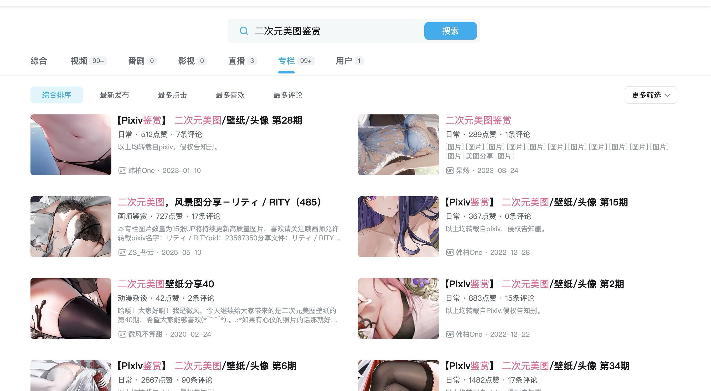
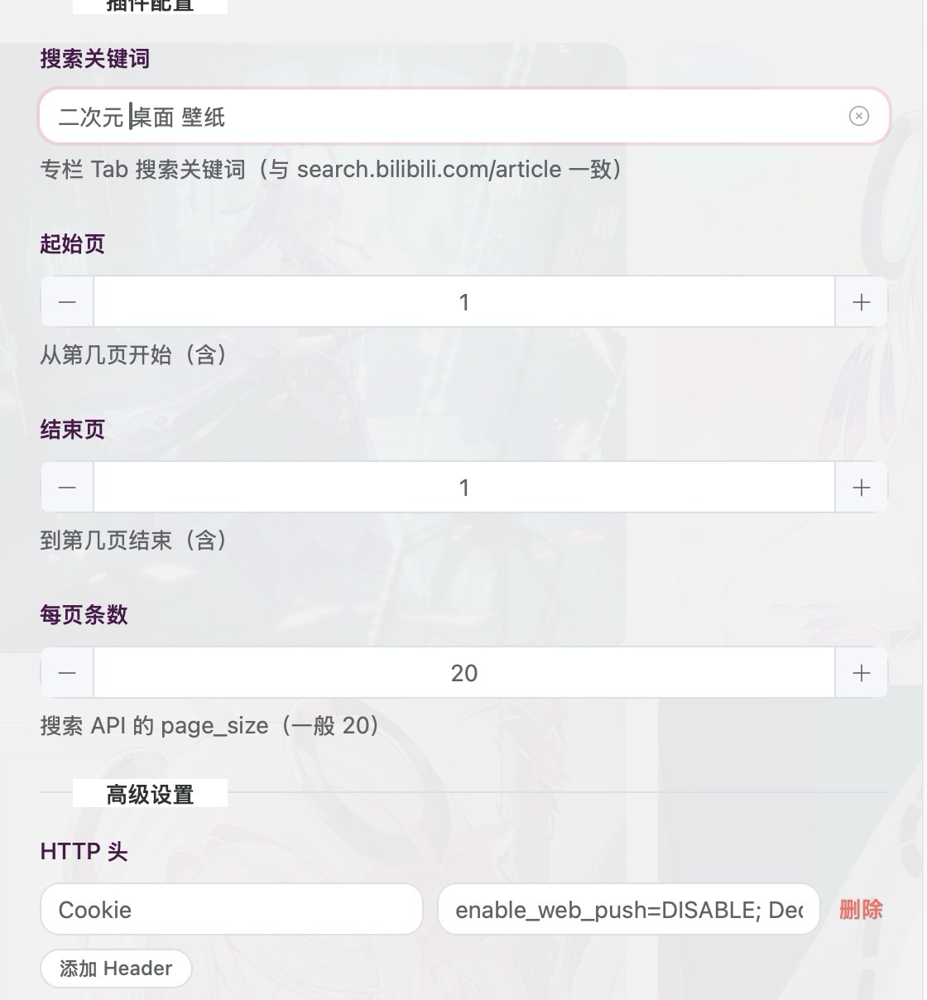
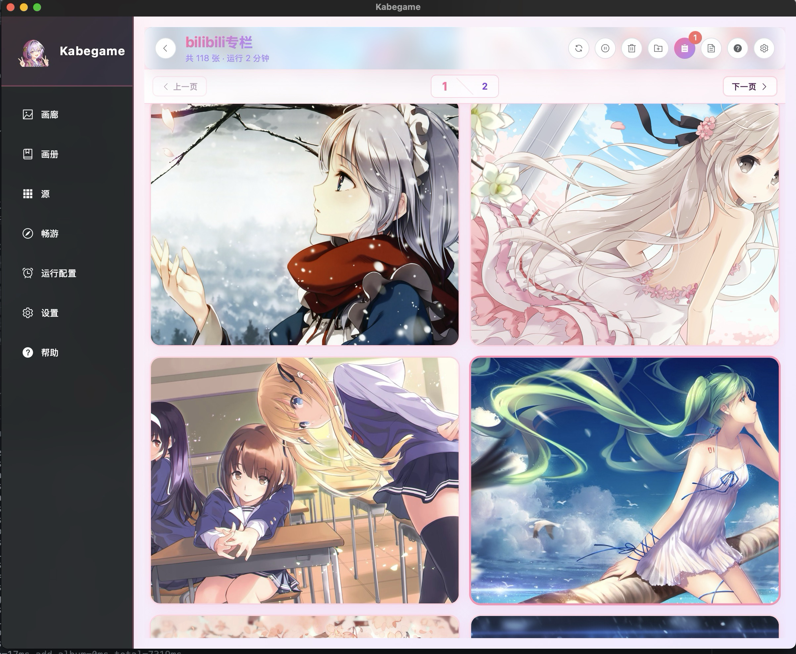
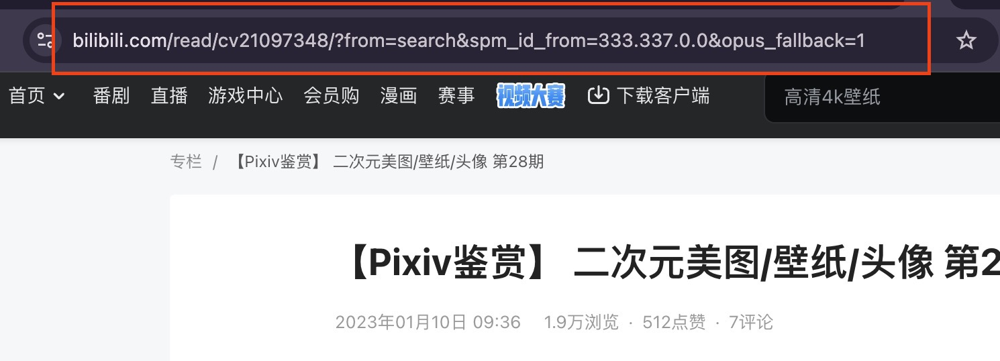
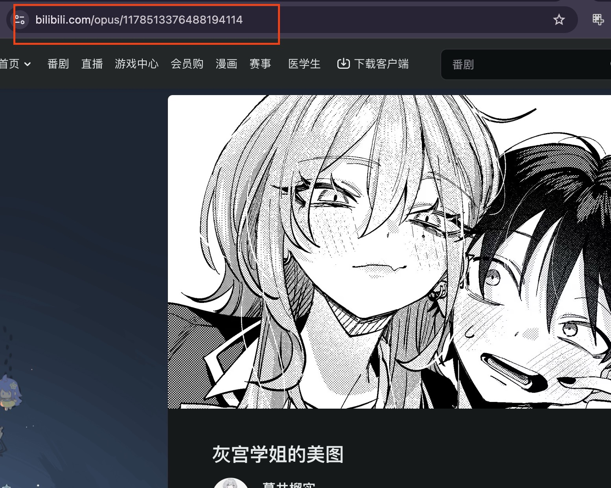

# 哔哩哔哩专栏：怎么把图收进画册

下面说的是：**你想从 B 站「专栏」里按关键词搜多篇、或只收单帖，把图收进 Kabegame 时，整体上会怎么走**，照着做心里就有数啦。（截图可在 `doc_root/` 下自行补充，与 Heybox 文档同款命名习惯即可。）

---

源选择哔哩哔哩专栏插件后，在任务里填参数并开始收集。

## 一、怎么用：按关键词搜专栏

**模式** 选 **「关键词搜索」** 时，按专栏 Tab 与网页 `search.bilibili.com/article` 一致的方式搜多篇：

1. **搜索关键词**  
   与网页 `search.bilibili.com/article` 专栏搜索一致，填你想搜的词（如壁纸、画师、作品名等）。

2. **起始页 / 结束页**  
   从第几页搜到第几页（均含）。页码越大，一次扫到的专栏越多，耗时与请求次数也越多。

3. **每页条数**  
   对应搜索接口的 `page_size`，一般 **20** 即可；具体以 B 站接口为准。

4. 开始收集后，程序会 **按页拉搜索列表 → 对每一篇专栏再拉正文 → 从正文里抠出图片地址并下载**。

---

## 二、怎么用：单帖（只收一篇）

任务里把 **模式** 选成 **「单篇专栏」**，在 **专栏 ID 或链接** 里填下面两类之一（插件表单里也有占位说明，与真实 id 无关的省略写法）：

### 1）传统专栏（cv）

- **可填**：浏览器地址栏里的专栏链接，形态一般为 `https://www.bilibili.com/read/cv…`（后面可带 `?from=search`、`opus_fallback=1` 等参数，**整段粘贴即可**）；或只填 **cv 数字 id**。
- **怎么收图**：与下文「关键词搜索」里搜到的每一篇专栏 **同一套路**——先拿 nav/WBI，再请求 **`x/article/view`**，从返回的正文 HTML 里抠 `bfs/article`、`bfs/new_dyn` 等图链。
- **Cookie**：与关键词搜索、批量收图 **一致**，高级设置里需要 **已登录的 Cookie**，否则接口容易 -101 / -352 或没有正文。

### 2）图文帖（opus）

- **可填**：`https://www.bilibili.com/opus/…` 这类图文详情页链接，或 **15 位以上的纯数字** id（雪花 id，与较短的 cv id 区分）。
- **怎么收图**：**不**走 nav、WBI、专栏 view 接口；而是用爬虫请求 **opus 详情页 HTML**，在页面里解析与正文一致的图链（`bfs/new_dyn` 等）。一般 **不需要** 为这一条单独折腾登录；若遇到 **空壳页、解析不到图**，可再尝试在高级设置里加上 Cookie 后重试。

---

## 三、每一篇专栏里，图是怎么被收进来的（说人话版）

对 **搜索到的每一篇专栏（cv）**，以及 **单篇模式下填的传统 cv**，大致走这几步：

1. **先向 B 站要「导航/WBI 密钥」**  
   用来给后面的搜索、详情接口签名，否则接口不认。

2. **按关键词分页搜索**（仅「关键词搜索」模式；单篇 cv 则直接使用你填的 id）  
   拿到当前页里所有 **专栏 id（cvid）** 列表。

3. **对每一篇再请求「专栏详情」接口**  
   返回里有一段 **正文 HTML**（不是你在浏览器里打开专栏页看到的那一整页 HTML，而是接口里的 `content` 字段）。

4. **在正文 HTML 里找图链**  
   会识别 `bfs/article`、`bfs/new_dyn` 等路径下的图片地址，补全 `https:` 后写入画册。

5. **同一篇里多张图会各下各的**  
   元数据里会带上来源、cvid、标题等，方便你在画册里辨认。

---

## 四、偶尔可能会遇到的情况

- 某篇 **正文里根本没有可识别的图**，这篇会跳过（进度仍会往前走）。
- **搜索某一页失败**：任务日志里会有提示；常见是 **未带登录态 / 风控**（本插件要求必须登录，见下文 Cookie）。
- **专栏页纯 HTML 直抓**（不走路由里的接口）在 **无登录 Cookie**、或命中 CSR 壳时，往往 **抠不到正文**；本插件走的是 **官方 JSON 接口 + 正文 HTML**，且 **必须以登录态 Cookie 调用**，和「只 curl 专栏 URL」不是一条路。
- 请求之间宿主会做间隔与重试，**偶尔多等一会儿**是正常的。

---

## 五、参数一览

| 名称 | 作用 | 默认 |
| --- | --- | --- |
| 模式 | 关键词搜索多篇专栏，或单篇只收一篇 | 关键词搜索 |
| 专栏 ID 或链接 | **仅单篇模式**：cv 链接 / 数字 id，或 opus 链接 / 长数字 id | （空） |
| 搜索关键词 | 专栏 Tab 搜索用的词 | 见插件内默认 |
| 起始页（从 1 起） | 从第几页开始（含） | 1 |
| 结束页（含） | 到第几页结束（含） | 1 |
| 每页条数 | 搜索 API 的 `page_size` | 20 |

插件 **没有单独的「Cookie」配置项**；**关键词搜索与传统 cv 单帖**依赖 **nav / 搜索 / view** 等接口，**需要**在高级设置里配置登录 Cookie。**图文 opus 单帖**以拉 HTML 为主，多数情况下可先不配 Cookie；失败时再按下一节尝试。

---

## 六、重要提醒（多看一眼咯）

### Cookie（在高级设置里配，不是插件表单里）

**Cookie** 是浏览器保存的一小段信息，用来维持登录等。本插件脚本 **不读写 Cookie**，也不会在 `config.json` 里让你填 Cookie。**必须先**在高级设置里配上已登录账号的 Cookie，否则 **关键词搜索** 与 **传统专栏（cv）单帖** 往往无法正常完成搜索与收图。

若已配置 Cookie 后，B 站仍返回 **未登录（如 -101）**、**风控（如 -352）**，或搜索/详情总是失败，请检查 Cookie 是否过期、是否完整，并可在：

- **开始收集 → 高级设置 → HTTP 头** 里 **添加或更新 Header**：名称填 `Cookie`，值填从浏览器里复制的整段 Cookie（常见需包含 `SESSDATA`、`bili_jct` 等）；或  
- **设置 → 插件默认 → 爬虫插件默认配置** 里，给本插件存 **默认请求头**，省得每次手填。

**有账号安全、风控封号等风险，请自负。** 勿把 Cookie 提交到公开仓库或发给别人。

### 为啥必须登录态（Cookie）

实测与站内策略相关：**未带登录 Cookie** 时，`nav`、搜索或 `view` 接口往往直接失败或没有业务数据；**必须**使用已登录浏览器里复制的 Cookie，同一套接口才能稳定拿到 **搜索列表和正文 HTML**，从而解析出图片。

若你只用「打开专栏网页、解析 HTML」的方式（不走路由里的签名接口），无 Cookie 时还经常只能拿到 **空壳页面**，正文要在前端 JS 里再拉——因此 **本插件在「关键词搜索 + cv 专栏详情」这条链路上以「必须配置登录态 Cookie」为前提**，不保证无 Cookie 下能收专栏图；**opus 图文单帖**另见上文第二节。

### 被风控、任务报错

在 **任务** 里点开对应条目，再点 **日志**，查看 **任务日志**。脚本在遇到 **-101 / -352** 时也会 **warn** 提示你确认高级设置里已配置有效的 **Cookie** 登录态请求头。

可以依次尝试：**确认高级设置里已配置有效登录 Cookie**、**换网络或过段时间再试**、**减少页数与频率**。

---

祝你把 B 站专栏里喜欢的图都收得顺顺利利啦。
