# 소흑갑(小黑盒, Heybox) 이미지를 앨범에 저장하는 방법

이 안내서는 소흑갑에서 마음에 드는 이미지를 Kabegame으로 가져올 때의 전체 흐름을 설명합니다. 순서대로 따라 하면 어떤 식으로 처리되는지 쉽게 알 수 있습니다. 스크린샷은 Kabegame Windows v3.4.3에서 촬영했습니다.

---

소스로 **소흑갑**을 선택합니다.

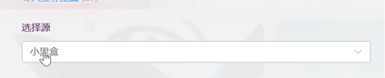

## 1. 게시물을 찾는 방법 선택

소흑갑에서는 두 가지 방법을 사용할 수 있습니다. 상황에 맞는 방법을 하나 선택하세요.

### 1. 키워드로 검색

특정 종류의 이미지를 찾고 싶을 때 사용합니다.

1. **크롤 모드**를 **키워드 검색**으로 설정합니다.

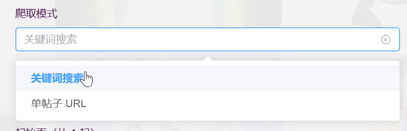

2. **검색어**에 벽지, 게임 이름, cosplay 등 찾고 싶은 단어를 입력합니다.

3. 필요에 따라 **시작 페이지 / 끝 페이지 / 페이지당 개수**를 입력합니다. 숫자가 클수록 한 번에 더 많은 게시물을 확인하지만 작업 시간도 길어집니다. 경험상 게시물 약 5개가 접근 제한이 발생하기 쉬운 경계입니다.

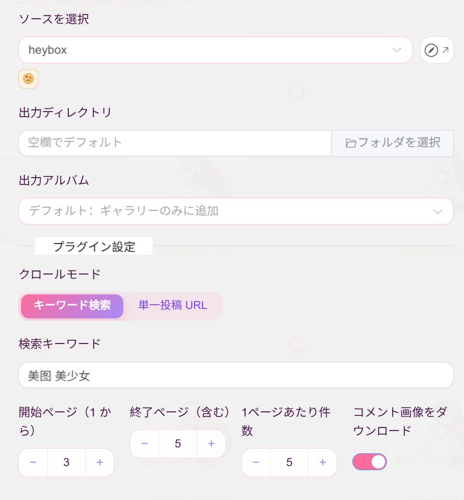

4. 수집을 시작하면 페이지별로 검색하여 열 수 있는 게시물을 하나씩 처리합니다.

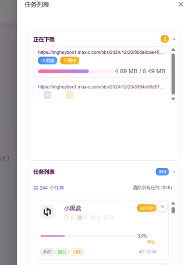
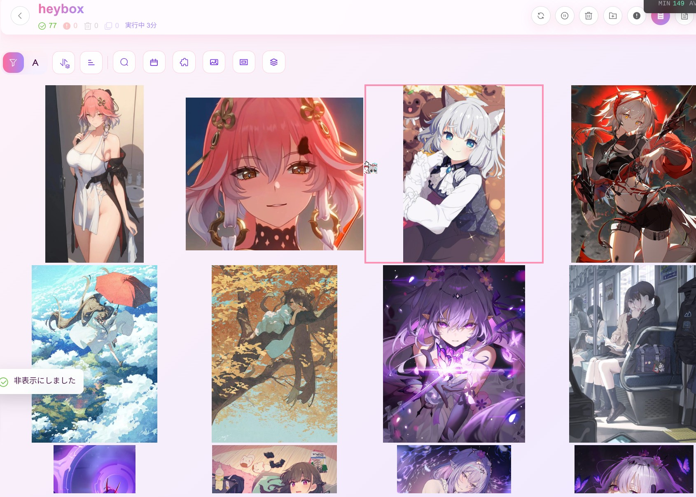
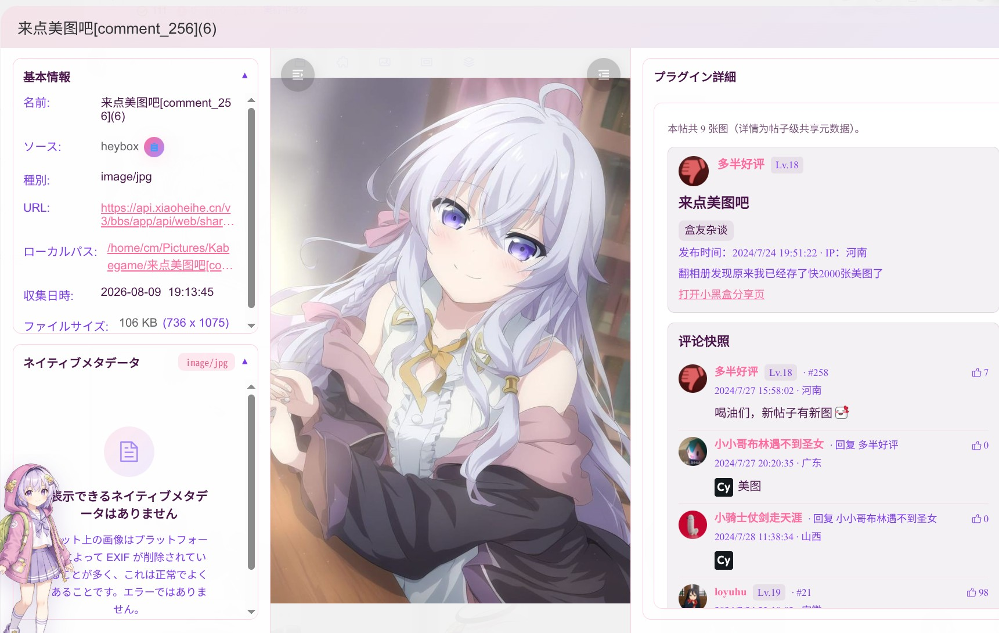

### 2. 게시물 하나만 수집

이미 게시물 링크를 알고 있을 때 사용합니다.

1. **크롤 모드**를 **단일 포스트 URL**로 설정합니다.
2. 소흑갑의 **게시물 공유** 버튼으로 복사한 링크를 **포스트 공유 URL**에 붙여 넣습니다. 반드시 공유 버튼에서 복사한 링크여야 하며, 브라우저 주소를 직접 복사한 링크는 사용할 수 없습니다. 아래 스크린샷을 참고하세요.

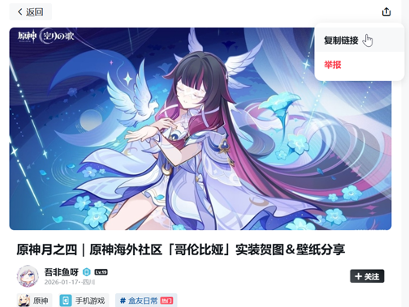

붙여 넣기:

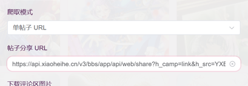

3. 이 게시물 하나만 처리하며 검색 페이지는 탐색하지 않습니다.

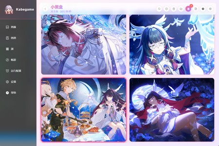
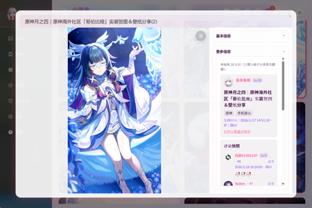

**개인적인 추천**  
두 번째 방법을 더 추천합니다. 소흑갑에서 마음에 드는 게시물을 먼저 찾은 뒤 공유 링크를 복사해서 이미지를 수집하세요. 일반적으로 **차단될 가능성이 더 낮고**, **더 정확하며**, 관련 없는 게시물이 섞이지 않습니다.

---

## 2. 게시물을 찾은 후 이미지가 저장되는 과정

검색으로 찾은 게시물이든 직접 지정한 게시물이든 **각 게시물**은 다음 과정을 거칩니다.

1. **게시물 본문 구조 가져오기**  
   본문의 글과 이미지가 블록 단위로 배치되어 있으며 플러그인이 이를 순서대로 확인합니다.

2. **이미지 블록만 인식하기**  
   이미지를 나타내는 각 블록에서 먼저 작은 미리보기를 가져와 순서와 이미지 수를 확인합니다.

3. **소흑갑에 원본 이미지 주소 요청하기**  
   각 미리보기에 해당하는 큰 이미지 주소를 다시 요청하고, 주소를 얻은 이미지만 앨범에 다운로드합니다.

4. **여러 이미지를 따로 저장하기**  
   같은 게시물의 이미지가 여러 장이면 제목 뒤에 번호를 붙이는 등의 방식으로 이름을 구분하여 저장합니다.

5. **댓글 영역(선택 사항)**  
   **댓글 이미지 다운로드**를 켜면 댓글의 이미지도 층별로 수집합니다. 게시물에 따라 댓글 이미지가 더 많은 경우도 있습니다. 끄면 본문의 이미지만 수집합니다.

---

## 3. 가끔 발생할 수 있는 상황

- 본문에 **이미지가 전혀 없는** 게시물은 건너뜁니다.
- 소흑갑에서 인증을 요구하거나 일시적으로 접근을 차단할 수 있습니다. 네트워크를 바꾸거나 잠시 후 다시 시도하면 해결되는 경우가 많습니다.
- 게시물과 이미지 사이에 **잠깐씩 대기**하므로 조금만 기다려 주세요.

---

## 4. 설정 목록

| 설정 | 표시 조건 | 역할 | 기본값 |
| --- | --- | --- | --- |
| 크롤 모드 | 항상 | 키워드 검색 / 단일 포스트 URL | 키워드 검색 |
| 포스트 공유 URL | 단일 게시물 모드 | 공유 링크 붙여 넣기 | 비어 있음 |
| 검색어 | 키워드 검색 | 검색할 내용 | 美图 |
| 자동 댓글 | 항상 | 크롤링한 게시물에 좋아요를 누르고 댓글 하나 등록 | 꺼짐 |
| 댓글 내용 | 자동 댓글 켰을 때 | 등록할 댓글 문구 | 我用 kabegame 把美图拿走喽，谢谢！ |
| 시작 페이지(1부터) | 키워드 검색 | 결과 수집을 시작할 페이지 | 1 |
| 끝 페이지(포함) | 키워드 검색 | 수집할 마지막 페이지 | 1 |
| 페이지당 개수 | 키워드 검색 | 페이지마다 가져올 게시물 수 | 5 |
| 댓글 이미지 다운로드 | 항상 | 본문＋댓글 이미지 / 본문만 | 켜짐 |

---

## 5. 중요 안내

**Cookie(고급)**  
**Cookie**는 로그인 상태 유지 등에 사용하도록 웹사이트가 브라우저에 저장하는 작은 정보입니다. **수집 시작 → 고급 설정 → HTTP 헤더**에서 **Header 추가**를 선택하고 이름에는 `Cookie`, 값에는 브라우저에서 복사한 문자열을 입력합니다. **설정 → 플러그인 기본값 → 크롤러 플러그인 기본 설정**에서 이 플러그인의 기본 요청 헤더로 저장하면 작업마다 다시 입력하지 않아도 됩니다. **계정 정지나 로그인 제한 등의 위험이 있으므로 본인의 책임으로 사용하세요.**

**Cookie를 사용하면 좋은 점**  
소흑갑 백엔드는 로그인하지 않은 상태에서 스크립트가 게시물 상세 정보를 대량으로 요청하는 것처럼 보이는 접근을 더 엄격하게 검사합니다. 공식 API를 사용하더라도 **Cookie가 없으면** **게시물 본문이나 중첩 댓글(`tree`)**을 가져오는 단계에서 사람 인증을 요구받기 쉬우며, 게시물 하나조차 완전히 열지 못할 수 있습니다. **소흑갑에 로그인한 Cookie**를 사용하면 요청이 **로그인 사용자**의 요청으로 처리됩니다. 테스트에서는 익명 접근보다 여러 게시물의 상세 정보를 연속으로 훨씬 안정적으로 가져올 수 있었습니다.

따라서 키워드 검색 페이지를 많이 탐색하거나 시작하자마자 인증을 반복해서 요구받는다면 고급 설정에서 Cookie를 지정해 보세요. 공유 링크 한두 개만 가끔 수집할 때는 Cookie 없이도 작동할 수 있지만, 일반적으로 Cookie를 설정하는 편이 더 안정적입니다.

**접근 제한 또는 작업 오류**

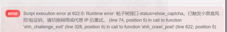

**작업**에서 해당 항목을 열고 **로그**를 누르면 **작업 로그** 창에서 자세한 내용을 확인할 수 있습니다. 포기하지 말고 다음 중 하나 이상을 시도해 보세요: **프록시 노드 변경**(대부분 이것만으로 해결됩니다), **기다렸다가 다시 시도**(반나절이나 하루 뒤 또는 다른 네트워크에서 시도), **Cookie 사용**(위의 Cookie 단락 참고. 로그인 상태가 익명 접근보다 대체로 안정적입니다).

---

소흑갑에서 마음에 든 이미지를 모두 순조롭게 앨범에 저장하시길 바랍니다!
