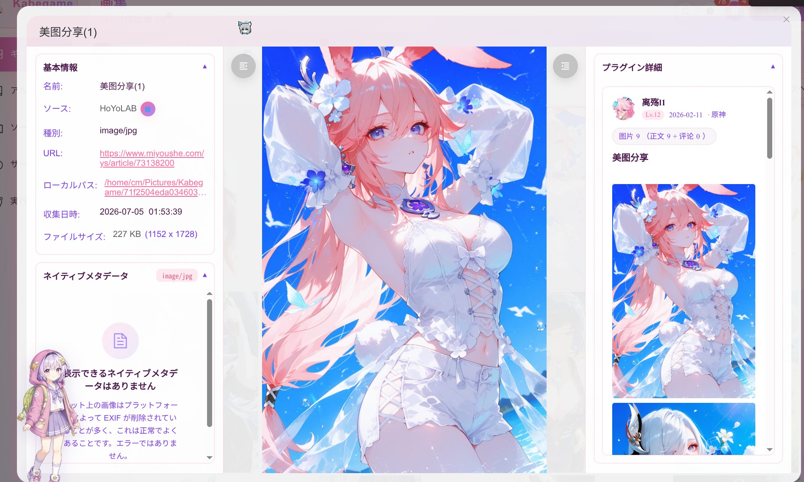
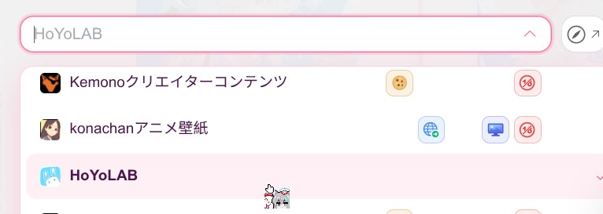
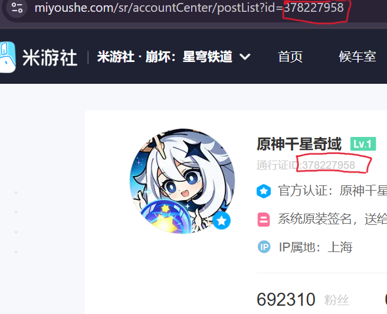

# 미요우서(Miyoushe) 이미지를 앨범에 저장하는 방법

이 안내서는 미요우서에서 마음에 드는 이미지를 Kabegame으로 가져올 때의 전체 흐름을 설명합니다. 순서대로 읽으면 각 단계가 하는 일, 입력할 설정, 문제가 생겼을 때 확인할 곳을 알 수 있습니다.

---

소스로 **미요우서**를 선택합니다.

---

## 1. 게시물을 찾는 방법 선택

현재 세 가지 방법을 사용할 수 있습니다. 하나를 선택하세요.

### 1. 키워드로 검색

특정 종류의 이미지를 찾을 때 사용합니다.

1. **크롤 모드**를 **키워드 검색**으로 설정합니다.
2. **검색어**에 “벽지”, “cosplay”, 캐릭터 이름 등 찾고 싶은 단어를 입력합니다.
3. 필요에 따라 **게임 섹션**(`gids`)을 선택합니다.
   - **전체**를 선택하면 더 넓은 범위에서 검색합니다.
   - 해당 게임 섹션을 선택하면 원하는 커뮤니티에 집중하기 쉽습니다.
4. **시작 페이지 / 끝 페이지 / 페이지당 개수**를 설정합니다.
   - 페이지가 많을수록 처리 시간이 길어지므로 먼저 작은 범위에서 테스트하세요.
   - `page_size`는 페이지마다 가져올 게시물 수이며, 플러그인이 이미지가 없는 게시물을 걸러냅니다.

### 2. 게시물 하나만 수집

이미 게시물 링크를 알고 있을 때 사용합니다.

1. **크롤 모드**를 **단일 포스트 URL**로 설정합니다.
2. **포스트 URL**에 미요우서 게시물 링크를 그대로 붙여 넣습니다.
   - 플러그인은 링크에서 `post_id`만 추출하면 됩니다.
   - 링크 예시: `https://www.miyoushe.com/{게임}/article/{id}`

### 3. 작성자 UID로 수집

작성자의 UID를 알고 있을 때 사용합니다.

1. **크롤 모드**를 **유저 포스트 목록**으로 설정합니다.
2. **작성자 UID**에 미요우서 사용자의 UID를 입력합니다. UID는 숫자 문자열이며 작성자 프로필 URL에서 확인할 수 있습니다.

3. **시작 페이지 / 끝 페이지 / 페이지당 개수**는 키워드 검색 모드와 동일합니다.
   - 기본값은 1～3페이지, 페이지당 20개입니다. 필요에 따라 조정하세요.
   - 먼저 한 페이지 같은 작은 범위에서 테스트하는 것을 권장합니다.

---

## 2. 게시물을 찾은 후 이미지가 저장되는 과정

검색으로 찾은 게시물이든 직접 지정한 게시물이든 플러그인은 다음 데이터 흐름으로 처리합니다.

1. **게시물 상세 정보 가져오기(`getPostFull`)**
   - 게시물의 주요 정보를 가져옵니다.
   - 특히 `post.images`와 `post.content`의 해당 이미지에서 본문 이미지 목록을 가져옵니다.
2. **이모티콘 세트 가져오기(`emoticon_set`)**
   - 메타데이터에는 본문(`subject/content`)에서 실제로 사용된 필수 이모티콘 매핑만 저장합니다.
   - 이미지 상세 페이지를 열면 댓글 이모티콘 표시에 사용할 전체 이모티콘 세트를 동적으로 가져옵니다.
3. **댓글 가져오기(`getPostReplies`)**
   - 댓글 내용은 더 이상 메타데이터에 저장하지 않습니다.
   - 이미지 상세 페이지에서 댓글을 동적으로 가져옵니다. 처음 20개가 표시되며 **더 보기**를 눌러 추가할 수 있습니다.
   - 수집 중 댓글 API는 통계 및 댓글 이미지 다운로드에만 사용하며 설정한 댓글 상한까지 계속 가져옵니다.
4. **이미지를 다운로드하여 앨범에 저장**
   - 게시물에 이미지가 있다면 본문 이미지는 항상 다운로드합니다.
   - 댓글 이미지는 `fetch_comment_images = true`일 때만 다운로드합니다.
   - 진행률은 본문 이미지와 댓글 이미지의 총개수에 따라 균등하게 나뉩니다.

---

## 3. 가끔 발생할 수 있는 상황

- **게시물에 이미지가 없음:** 플러그인이 해당 게시물을 건너뛰고 이미지가 있는 게시물만 처리합니다.
- **간헐적인 API 오류:** 네트워크를 바꾸거나 잠시 기다린 뒤 다시 시도하세요.
- API 오류가 발생하면 잠시 후 다시 시도하는 것으로 대부분 해결됩니다.

---

## 4. 설정 목록

| 설정 | 표시 조건 | 역할 |
| --- | --- | --- |
| 크롤 모드 | 항상 | 키워드 검색 / 단일 포스트 URL / 유저 포스트 목록 |
| 포스트 URL | 단일 게시물 모드 | 게시물 링크를 붙여 넣고 `post_id` 자동 추출 |
| 작성자 UID | 유저 포스트 목록 | 수집할 작성자 UID |
| 검색어 | 키워드 검색 | 검색할 키워드 |
| 게임 섹션 | 키워드 검색 | 해당 `gids` 섹션 선택(선택 사항) |
| 시작 페이지(1부터) | 키워드 검색 / 유저 포스트 목록 | 수집을 시작할 페이지 |
| 끝 페이지(포함) | 키워드 검색 / 유저 포스트 목록 | 수집할 마지막 페이지 |
| 페이지당 개수 | 키워드 검색 / 유저 포스트 목록 | 페이지마다 가져올 게시물 수 |
| 댓글 이미지 다운로드 | 항상 | 켜짐: 본문＋댓글 이미지, 꺼짐: 본문만 |
| 댓글 최대 수집 개수(`max_comments`) | 항상 | 수집 단계에서 가져올 최대 댓글 수(기본값 200) |

---

미요우서에서 마음에 든 이미지를 모두 순조롭게 앨범에 저장하시길 바랍니다!
