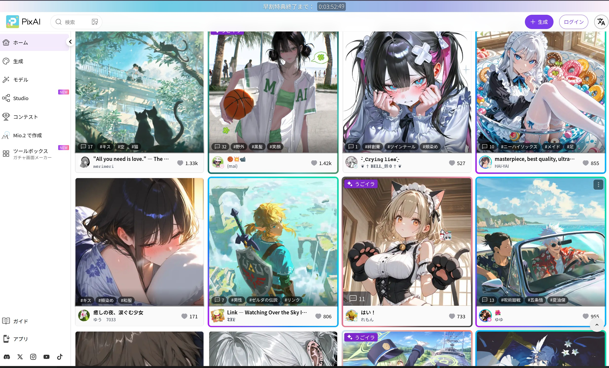
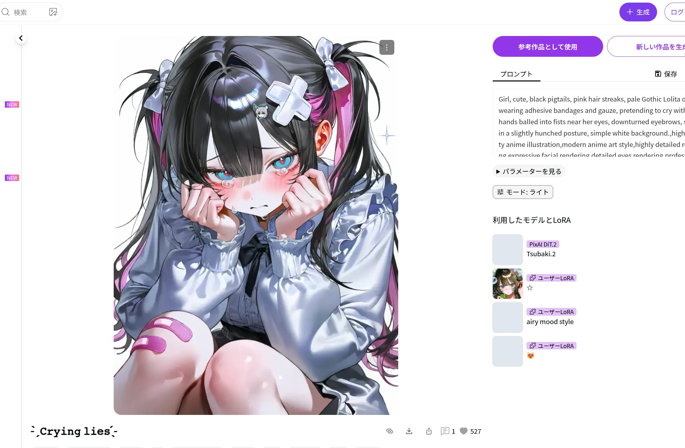

# PixAI

從 [PixAI](https://pixai.art) 批次下載公開的 AI 圖片與動態作品，並儲存至 Kabegame 畫廊。
支援全站作品流、依模型、依標籤、排行榜及依作者五種爬取方式。

## 快速開始

1. 確認 Kabegame 的網路或代理可以正常存取 `pixai.art` 及其圖片網域。
2. 新增下載任務並選擇來源「PixAI」。初次使用也可以直接匯入外掛提供的推薦設定。
3. 選擇「爬取種類」，再設定排序與頁碼。若要先少量試跑，可選擇「全站」與趨勢排序，
   將「起始頁數 / 結束頁數」設為 `1 / 1`；每頁通常約有 24 個作品。
4. 啟動任務。外掛會讀取作品詳細資訊，並將可公開存取的媒體儲存至畫廊。

## 下載內容

PixAI 的作品頁除了圖片，還可能包含標題、作者、提示詞、說明、標籤、使用的模型與 LoRA、
按讚數和留言等資訊。

下載時，外掛會補充每個作品的詳細資訊與近期留言，並儲存 PixAI 原始作品連結。動態作品會優先使用
動態媒體資源；靜態作品則使用公開圖片資源。存入媒體庫後，可在 Kabegame 瀏覽下載結果，並從詳細資訊返回原頁面。

## 爬取模式

### 全站

依 PixAI 的全站作品流下載，適合瀏覽熱門作品或持續補充圖庫。

- 「作品排序」支援趨勢、日榜、熱門、最新與建立時間等順序。
- 「起始頁數 / 結束頁數」指定下載範圍，包含結束頁。
- 例如 `1 / 5` 代表下載第 1～5 頁；`3 / 5` 會先翻過前兩頁，只下載第 3～5 頁。

### 依模型

先按「模型排序」走訪模型列表，再下載每個模型對應的作品流。

- 「模型頁數」是從第一頁算起的模型頁上限；「略過模型頁數」只翻頁，不處理其中的模型。
- 「每個模型作品頁數」限制每個模型存取到第幾頁，「起始頁數」決定從其中第幾頁開始下載。
- 「作品排序」會分別套用至每個模型的作品流。

此模式的下載量會快速增加：一個模型頁通常約有 24 個模型，每個模型的一個作品頁又通常約有
24 個作品。請先使用較小的「模型頁數」與「每個模型作品頁數」試跑。

### 依標籤

依序解析「標籤 codeName」，再下載每個標籤下的作品。

- codeName 不是頁面顯示名稱，而是標籤頁 URL 中的識別字，例如 `genshin_impact`。
- 可一次輸入多個 codeName；無效或不存在的標籤會顯示提示並略過。
- 「每個標籤作品頁數」是頁碼上限，「起始頁數」決定從第幾頁開始下載。
- 例如起始頁為 `3`、頁數為 `5` 時，實際下載第 3～5 頁，而不是第 3～7 頁。

標籤解析結果會被快取，之後再次執行相同標籤時不必重複查詢。

### 排行榜

依榜單類型與範圍抓取 PixAI 排行榜。

| 榜單類型 | 行為 |
| --- | --- |
| 作品 | 下載日榜、週榜或月榜中的靜態作品，最多請求榜單前 100 項 |
| うごイラ（動圖） | 下載日榜、週榜或月榜中的動態作品，最多請求榜單前 100 項 |
| SD 模型 | 走訪榜單中的 SD 模型，再下載每個模型的趨勢作品 |
| LoRA | 走訪榜單中的 LoRA，再下載每個 LoRA 的趨勢作品 |

作品榜與動圖榜本身不分頁，因此「起始頁數 / 結束頁數」對它們不生效。模型榜與 LoRA 榜可能各傳回
最多 100 個模型，再為每個模型下載「每個上榜模型作品頁數」指定的頁數，下載量可能非常大。

### 依作者

下載指定 PixAI 作者的圖片或動態作品。

- 「作者 ID」填寫使用者主頁 URL 中的純數字 ID，不是顯示名稱或 `@username`。
- 「爬取類型」選擇圖片或動圖；圖片模式包含一般作品與圖集。
- 「作者作品頁數」是頁碼上限，可搭配「起始頁數」與「作品排序」縮小範圍。

## 頁碼規則

PixAI 的作品列表使用游標分頁，無法直接跳到任意頁。因此從第 N 頁開始時，外掛仍需依序請求前
N−1 頁來取得游標，只是不下載這些頁面的作品。這會消耗少量時間與網路請求。

- 頁碼從 `1` 開始。
- 全站模式使用「結束頁數」作為末頁。
- 模型、標籤與作者模式使用各自的「作品頁數」作為末頁上限。
- 依模型時，「略過模型頁數」只作用於模型列表；「起始頁數」作用於每個模型的作品列表。
- 排行榜的作品榜與動圖榜不使用作品頁碼設定。

如果末頁早於起始頁，全站模式會顯示警告並只下載起始頁。其他模式中，起始頁高於對應頁數上限時
不會產生有效下載頁，請調整設定後重試。

## 推薦設定

外掛附帶以下設定，可直接匯入後執行或繼續修改：

| 設定 | 用途 |
| --- | --- |
| 全站趨勢（前 5 頁） | 快速瀏覽熱門公開作品 |
| 每日全站日榜（前 5 頁） | 預設每天 18:00 執行，適合持續更新圖庫 |
| 趨勢模型（每模型 1 頁作品） | 走訪趨勢模型並下載代表作，下載量較大 |
| 排行榜 · 今日作品 | 下載當日作品榜 |
| 標籤範例（原神／星鐵／星原） | 示範一次設定多個標籤 codeName |

推薦設定中的頁數與排程，都可以在匯入後的執行設定中修改。

## 注意事項

- 外掛只下載目前網路環境下可公開存取的媒體；作品已刪除、設為私人或詳細資訊介面失敗時會略過。
- 全站、標籤、模型與排行榜模式會啟用安全內容過濾；依作者模式採用 PixAI 作者作品流的預設過濾結果。
- 同一作品可能同時出現在多個標籤、模型或榜單中。組合多個範圍時，請留意重複內容與總下載量。
- PixAI 介面或圖片網域無法存取時，請先檢查代理與網路；標籤模式沒有結果時，再確認 codeName 是否與 URL 完全一致。
- 請遵守 PixAI 的使用規則與作品作者設定的授權範圍。
