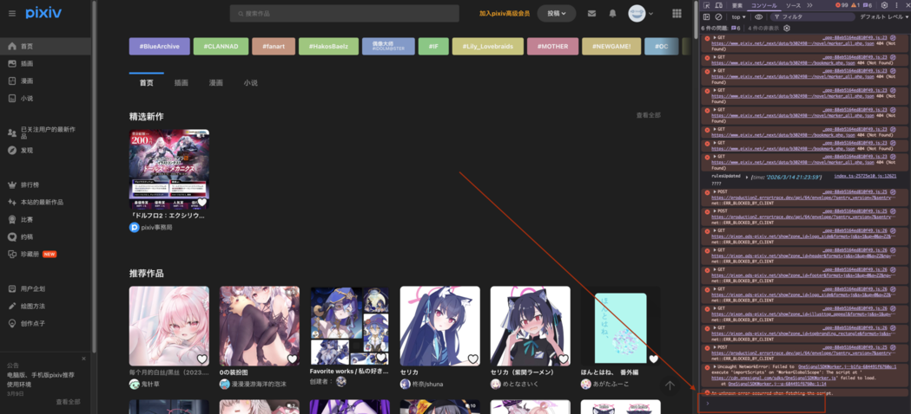
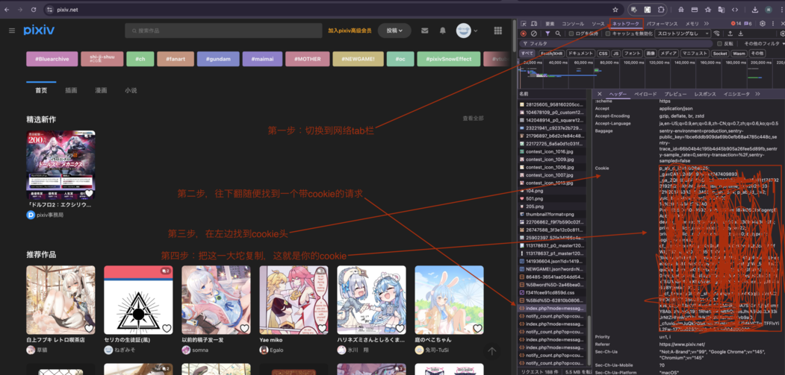
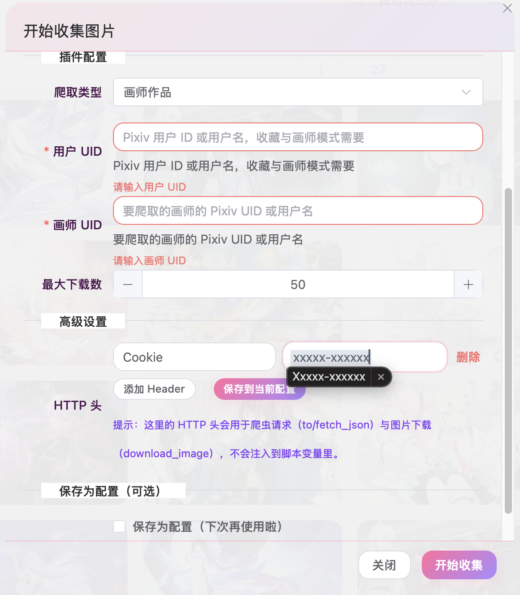
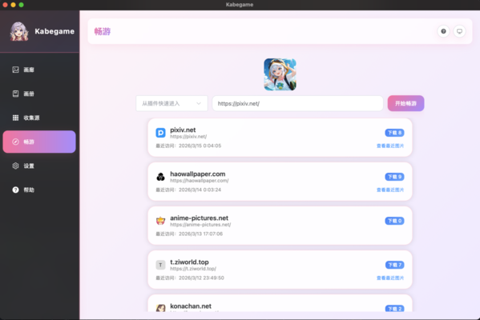
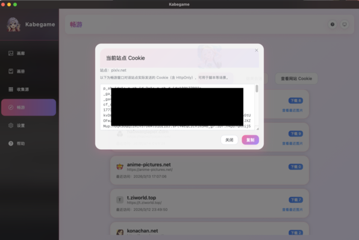

# Pixiv Crawler - Plugin Guide

This plugin fetches illustrations from Pixiv. It supports four modes: rankings, bookmarks, artist works, and keyword search.

## HTTP Headers (Required)

Pixiv API requires authentication and Referer. **You must set Cookie under "Advanced settings → HTTP headers"**; it is not injected as a plugin variable.

### How to Get Cookie

#### Method 1: Copy from browser

1. **Log in** (or register) at [pixiv.net](https://www.pixiv.net) in your browser.

2. Open Developer Tools (F12), switch to the Network tab (red box in the image).

3. Copy your cookie as shown in the image.

4. Open Kabegame.
5. Add the HTTP header in the config that requires cookie.

#### Method 2: Copy from Kabegame Surf (easier, desktop only)

1. Open Kabegame and go to the Surf tab.

2. Quick entry → select Pixiv → click "Start surfing". A Pixiv window will open; log in if prompted.

3. After logging in, click "View site cookie" (keep the window open). A dialog will show the cookie; copy it.

4. You're all set!

### How to Get User ID (yours or an artist’s)

Open the user’s profile on Pixiv. The numeric part in the URL (middle or end) is the user ID.

### When Cookie Is Required

| Mode | Cookie |
|------|--------|
| Rankings (non-R18) | Optional |
| Rankings (R18) | Required |
| Bookmarks | Required |
| Artist works (non-R18) | Optional |
| Artist works (R18) | Required |
| Keyword search (non-R18) | Optional |
| Keyword search (R18) | Required |

## Crawl Types

- **Rankings**: Ranking order + content + age rating; single `ranking_date` (empty = Pixiv returns the latest period).
- **Bookmarks**: Download your public bookmarks.
- **Artist works**: Download public works of a given artist.
- **Keyword search**: Search by keyword and download.

## Config Fields

Fields depend on the selected mode:

- **Rankings**: **Ranking order** (daily/weekly/monthly/rookie/original/AI daily/male/female); **content type** only for daily/weekly/monthly/rookie; **age rating** (safe/R18) when supported—R18 requires Cookie and **User UID** (`user_id` for `x-user-id`); **ranking date** `YYYYMMDD` (omit `date` param when empty). Pagination follows the **`next`** field in the JSON response (~500 entries max per ranking).
- **Bookmarks**: User UID.
- **Artist**: User UID, artist UID.
- **Keyword**: Search keyword, search mode (safe / R18 / all), sort (by date / by popularity). **Keyword + sort lets you target exactly what you want.**

## Max artworks (`num_artworks`)

Integer **1–1000**, used in **all four modes**. The cap counts **artworks** (one illustration entry), not final image files; **multi-page works** still download each page, so **file count can exceed** `num_artworks`.

The script is **streaming**: it requests list APIs **page by page**, and for each `illust_id` it immediately calls `ajax/illust/{id}/pages` and downloads originals. When `num_artworks` is reached it **stops**—it does **not** precompute a fixed page count from the cap, avoiding empty-page **404**s.

### Behaviour summary

1. **Rankings**  
   One period per run; `p=1` then follow **`next`** (next page number) until `next` is false or the cap is reached. If fewer than `num_artworks` were downloaded, the script emits a **`warn`**.

2. **Bookmarks**  
   `limit=48` per page; after each response, **download** works on that page until the cap or no more bookmarks.

3. **Artist**  
   Still one **`profile/all`** call (no list pagination); then iterate `body.illusts` keys **in order**, download until `num_artworks`.

4. **Keyword**  
   Like rankings: search pages `p=1,2,…`, download as you go until the cap or a short page.

## Example runs (what the script actually does)

Cookie and mode-specific query values come from your form; dates are **`YYYYMMDD`** (no dashes).

### Example A: Rankings (streaming, `next` pagination)

| Field | Example |
|-------|---------|
| Source | Rankings |
| Ranking mode | Daily (`daily`) |
| Content | All (`all`) |
| Age rating | Safe (`safe`) |
| Ranking date | empty (latest) or `YYYYMMDD` |
| Max artworks | `120` |

**Flow**  
Request `ranking.php?mode=daily&content=all&p={p}&format=json` (add `&date=` when set). Use the `next` field in the response as the next page; stop when `next` is false or the cap is reached.

---

### Example B: Bookmarks (paged, download as you go)

| Field | Example |
|-------|---------|
| Source | Bookmarks |
| User UID | e.g. `12345678` |
| Max artworks | `50` |

**Flow**  
From `offset=0`, `limit=48` per request; for each `body.works[].id` run the `pages` download until **50** artworks processed or the page has fewer than 48 items.

---

### Example C: Artist (one list request, streaming cap on download)

| Field | Example |
|-------|---------|
| Source | Artist works |
| Logged-in user UID (`x-user-id`) | Your account UID |
| Artist UID | e.g. `87654321` |
| Max artworks | `5` |

**Flow**  
One request to `https://www.pixiv.net/ajax/user/87654321/profile/all?lang=zh`, then download **at most 5** artworks in key order (each may be multi-image).

---

### Example D: Keyword search (streaming by search page)

| Field | Example |
|-------|---------|
| Source | Keyword |
| Keyword | e.g. `初音ミク` |
| Search mode | Safe (`safe`) |
| Sort | By date (`date_d`) |
| Max artworks | `25` |

**Flow**  
`p=1,2,…` on `ajax/search/artworks/...`; for each page, download `illustManga.data[].id` until **25** or fewer than **60** results (usually no next page).

---

These four examples map to the four `source` values. **Common rule:** cap is `num_artworks`; modes with paged lists are **streaming**.

## Notes

- If the ranking run ends with fewer artworks than `num_artworks`, a **warn** is logged.
- On 403 errors, try refreshing your cookie. Occasional 403 may be rate limiting; run the task again or download manually from the Surf page.
- Refresh cookie when it expires.
- Keywords support advanced syntax, e.g. `(Lucy OR 边缘行者) AND 5000users`.
- **Sort by popularity** requires a Pixiv Premium account; use "Sort by date" otherwise.
- Set a reasonable max artwork count to avoid overloading Pixiv.
