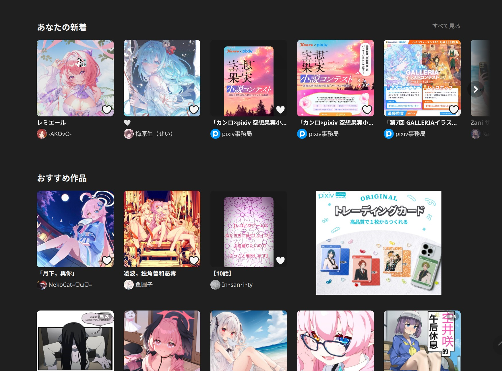
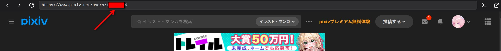

# Pixiv 爬虫 - 插件说明

本插件用于从 Pixiv 爬取插画，支持排行榜、个人收藏、画师作品、关键词搜索四种模式。

## 登陆态
请先从kabegame的畅游界面打开pixiv.net，这样就会自动以你的身份爬取啦。

### 如何获取用户 ID（自己的和画师的）
通过畅游或者浏览器在p站打开用户主页

然后在顶部链接处中间部位或者末尾部位你可以看到一串数字（图中红色框），这就是用户id啦

### 何时需要 Cookie

| 模式 | Cookie |
|------|--------|
| 排行榜（非 R18） | 可选 | 
| 排行榜（R18） | 必填 |
| 个人收藏 | 必填 | 必填 |
| 画师作品（非 R18） | 可选 |
| 画师作品（R18） | 必填 |
| 关键词搜索（非 R18） | 可选 |
| 关键词搜索（R18） | 必填 |

## 爬取类型

- **排行榜**：榜序 + 内容类型 + 年龄向；单日期 `ranking_date`（留空则 Pixiv 返回最新一期）
- **个人收藏**：下载你公开收藏的插画
- **画师作品**：下载指定画师的公开作品
- **关键词搜索**：按关键词搜索并下载

## 配置项

根据选择模式，表单会显示不同配置项（`when` 条件显示）：

- **排行榜**：**榜序**（日/周/月/新生/原创/AI 日/男/女）；**内容类型**仅在日/周/月/新生下显示；**年龄向**在支持 R18 的榜序下显示，选 R18 须填 **用户 UID**（`user_id`，x-user-id）与 Cookie；**排行榜日期** `ranking_date` 留空不传 `date`。分页由接口 **`next`** 字段驱动；单榜约 500 条上限。
- **收藏**：用户 UID
- **画师**：用户 UID、画师 UID
- **关键词**：搜索关键词、搜索模式（安全/R18/全部）、排序方式（按日期/按人气）。**这是最有意思的部分，用好的话可以精确爬到你喜欢的**

## 最大作品数（`num_artworks`）

表单字段为 **1～1000** 的整数，**四种模式都会用到**。计数单位是 **作品（一条插画/条目）**，不是最终落盘的图片张数；漫画等多页作品仍会按页下载多张原图，因此**文件数可能大于** `num_artworks`。

脚本采用 **流式**：列表接口 **按页请求**，每解析出一个作品 ID 就立即请求 `ajax/illust/{id}/pages` 并下载原图；已达到 `num_artworks` 时 **立即停止**，不再去预取后续列表页，从而避免「按目标总数反算页数」导致的空页 **404**。

### 行为概要

1. **排行榜**  
   单次周期内从 `p=1` 请求 `ranking.php?...&format=json`，下一页取响应 **`next`**；`next == false` 时结束。不足 `num_artworks` 时 **`warn`** 提示。

2. **收藏**  
   每页 `limit=48`，拉一页后**立刻下载**本页各作品，直到达到 `num_artworks` 或书签耗尽。

3. **画师**  
   列表仍依赖 **单次** `profile/all`（接口无分页）；拿到 `body.illusts` 的 key 后 **按顺序边下边数**，满 `num_artworks` 即停。

4. **关键词**  
   与排行榜类似：`p=1,2,…` 逐页搜索，页内流式下载，满额或结果不足一页时结束。

## 配置运行实例（脚本实际怎么跑）

下面说明任务启动后的顺序；URL 中 Cookie、模式等以你表单为准。日期变量为 **`YYYYMMDD`**（无横杠）。

### 实例 A：排行榜（流式、`next` 翻页）

| 配置项 | 示例值 |
|--------|--------|
| 爬取类型 | 排行榜 |
| 榜序 | 日榜（`daily`） |
| 内容类型 | 全部（`all`） |
| 年龄向 | 全年龄（`safe`） |
| 排行榜日期 | 留空或 `YYYYMMDD` |
| 最大作品数 | `120` |

**流程**  
从 `p=1` 请求 ranking JSON，用响应中的 **`next`** 作为下一页；满 `120` 或 **`next` 为 false** 则停。

---

### 实例 B：个人收藏（按页拉书签，边下边停）

| 配置项 | 示例值 |
|--------|--------|
| 爬取类型 | 个人收藏 |
| 用户 UID | 例如 `12345678` |
| 最大作品数 | `50` |

**流程**  
`offset=0` 起每页 `limit=48` 请求书签接口；对返回的 `body.works[].id` **逐个**走 `pages` 下载，直到已处理 **50** 个作品或本页不足 48 条（无更多书签）。

---

### 实例 C：画师作品（全量列表一次，下载流式截断）

| 配置项 | 示例值 |
|--------|--------|
| 爬取类型 | 画师作品 |
| 登录用户 UID（`x-user-id`） | 你的账号 UID |
| 画师 UID | 例如 `87654321` |
| 最大作品数 | `5` |

**流程**  
一次请求 `https://www.pixiv.net/ajax/user/87654321/profile/all?lang=zh`，再按 `body.illusts` 的 key 顺序 **最多下载 5 个作品**（每个作品仍可能多图）。

---

### 实例 D：关键词搜索（按搜索页流式）

| 配置项 | 示例值 |
|--------|--------|
| 爬取类型 | 关键词搜索 |
| 关键词 | 例如 `初音ミク` |
| 搜索模式 | 安全（`safe`） |
| 排序 | 按日期（`date_d`） |
| 最大作品数 | `25` |

**流程**  
`p=1,2,…` 请求 `ajax/search/artworks/...`；每页对 `illustManga.data[].id` **边下边数**，满 **25** 或单页结果少于 60（通常无下一页）则停。

---

以上四例对应四种 `source`；排行榜 URL 由表单三维度与脚本拼接。**共同点：以 `num_artworks` 为上限，分页列表均为流式。**

## 注意事项

- 排行榜若最终数量不足 `num_artworks`，脚本会 **warn** 提示。
- 如果遇到403了，可以考虑重新获取一下cookie。如果只是偶发，那可能是被限流了，多运行几次任务，实在不行手动在畅游页面下载。
- Cookie 过期后需重新获取
- 关键词支持高级搜索语法，如 `(Lucy OR 边缘行者) AND 5000users`
- **按人气排序**需要 Pixiv Premium 账户，非 Premium 请使用「按日期」
- 请合理设置最大作品数，避免对 Pixiv 造成过大压力
