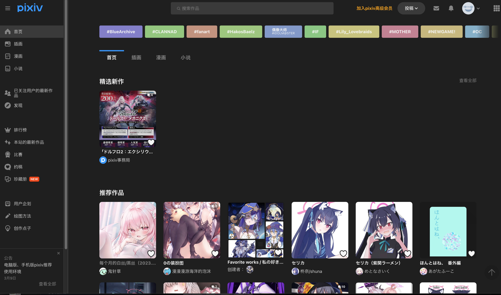
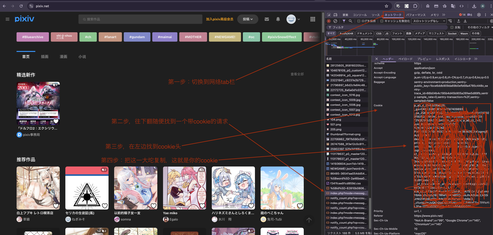
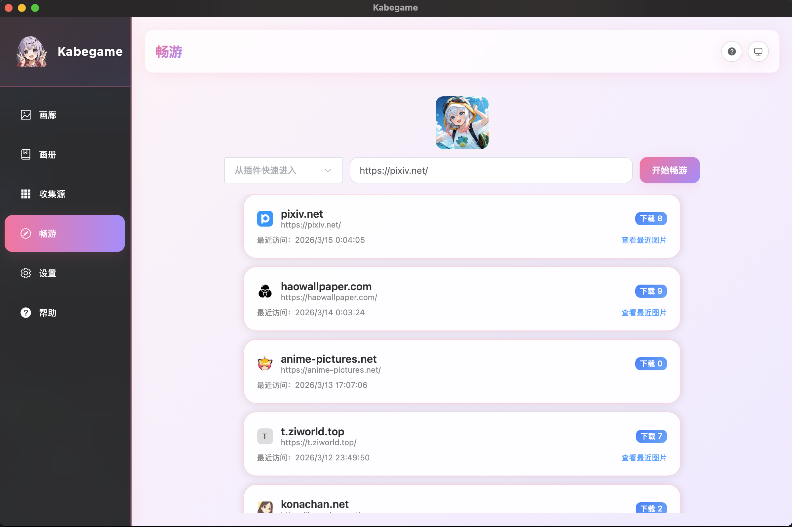
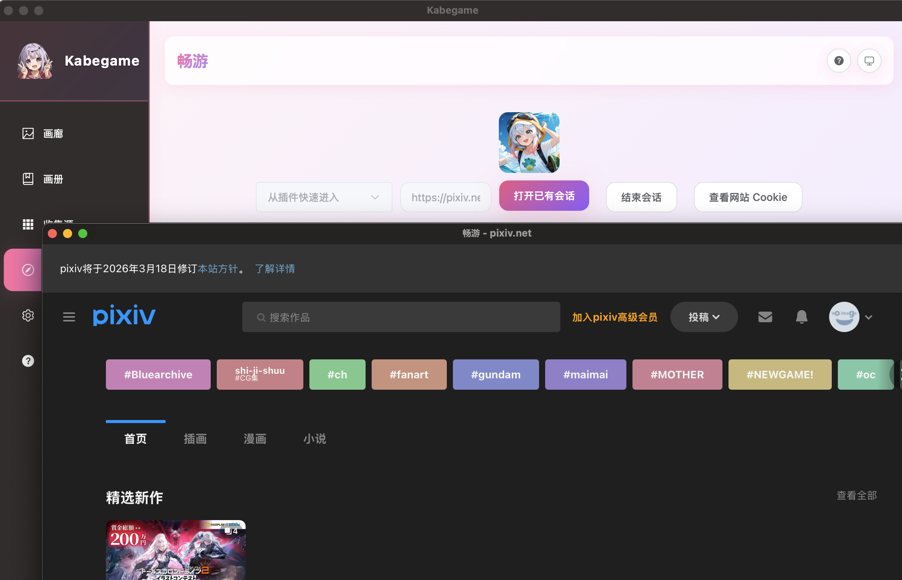
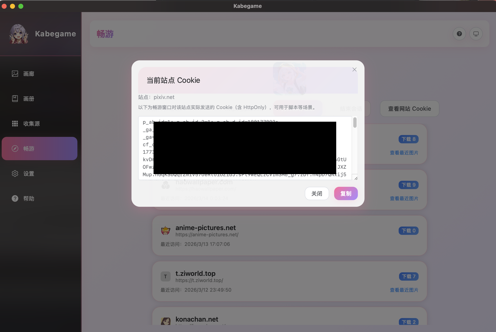
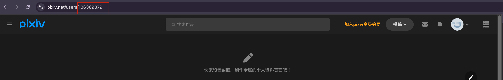

# Pixiv 爬虫 - 插件说明

本插件用于从 Pixiv 爬取插画，支持排行榜、个人收藏、画师作品、关键词搜索四种模式。

## HTTP 头配置（必读）

Pixiv API 需要认证与 Referer。**Cookie 需在「高级设置 → HTTP 头」中填写**，不会作为插件变量注入。

### 如何获取 Cookie

### 方法一：通过浏览器复制

1. 使用浏览器**登录(没有登陆就注册)** [pixiv.net](https://www.pixiv.net)

2. 打开开发者工具（F12），切换到网络选项卡（图中标示的红色输入框）

3. 按照下图步骤复制你的cookie

4. 打开kabegame
5. 在需要提供cookie的配置下，添加http头

### 方法二：通过Kabegame畅游页面复制（更简单， 但需要在电脑上）
1. 打开 Kabegame，进入畅游tab

2. 从插件快速进入 -> 选择pixiv -> 点击“开始畅游”
这时候会弹出pixiv的主页窗口，如果提示登录的话在这里登录

3. 登录完毕之后点击查看网站cookie（不要关闭窗口），会弹出窗口，复制即可

4. 愉快玩耍！

### 如何获取用户 ID（自己的和画师的）
很简单，直接在p站打开该用户主页

然后在顶部链接处中间部位或者末尾部位你可以看到一串数字（图中红色框），这就是用户id啦

### 何时需要 Cookie

| 模式 | Cookie |
|------|--------|
| 排行榜（非 R18） | 可选 | 
| 排行榜（R18） | 必填 |
| 个人收藏 | 必填 | 必填 |
| 画师作品（非 R18） | 可选 |
| 画师作品（R18） | 必填 |
| 关键词搜索（非 R18） | 可选 |
| 关键词搜索（R18） | 必填 |

## 爬取类型

- **排行榜**：按日榜/周榜/月榜等下载指定日期的作品
- **个人收藏**：下载你公开收藏的插画
- **画师作品**：下载指定画师的公开作品
- **关键词搜索**：按关键词搜索并下载

## 配置项

根据选择模式，表单会显示不同配置项（`when` 条件显示）：

- **排行榜**：排行榜类型、内容类型、起始日期（YYYYMMDD）、日期范围、最大下载数
- **收藏**：用户 UID、最大下载数
- **画师**：用户 UID、画师 UID、最大下载数
- **关键词**：搜索关键词、搜索模式（安全/R18/全部）、排序方式（按日期/按人气）、最大下载数。**这是最有意思的部分，用好的话可以精确爬到你喜欢的**

## 注意事项

- 如果遇到403了，可以考虑重新获取一下cookie。如果只是偶发，那可能是被限流了，多运行几次任务，实在不行手动在畅游页面下载。
- Cookie 过期后需重新获取
- 关键词支持高级搜索语法，如 `(Lucy OR 边缘行者) AND 5000users`
- **按人气排序**需要 Pixiv Premium 账户，非 Premium 请使用「按日期」
- 请合理设置最大下载数，避免对 Pixiv 造成过大压力
