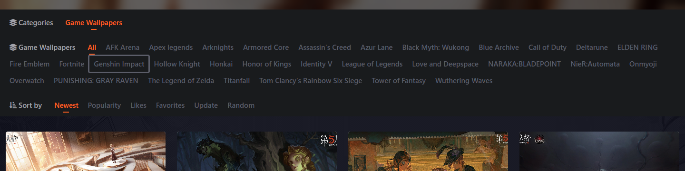

# 2dwallpaper Plugin Guide

Fetches wallpapers from [2dwallpapers.com](https://2dwallpapers.com). A task now only needs a **work**, **start page**, **end page**, and **sort order**.

## Work

The work is a concrete entry on the site category pages, such as `Genshin Impact`. The plugin searches the game and anime sections for the first matching work, then crawls only that work's own paginated list.

The uncategorized section has no concrete work entries. To crawl it, leave work empty; the plugin crawls `https://2dwallpapers.com/uncategorized` directly and does not filter subdirectories.

- Default value: empty
- Matching: regular expression against the work name or link. For example, `Genshin` matches `Genshin Impact`
- Prefer matching one work at a time, because page numbers belong to a specific work list
- Uncategorized: leave work empty to crawl the uncategorized pagination directly

The highlighted item below is the work entry:

## Page Range

`start_page` and `end_page` define the work-list pages to crawl. Page 1 uses the work list URL itself; page 2 and later use the site's `/page/{page}` path.

The plugin reads the total page count from the site pagination and logs the site total, requested range, skipped pages, actual processed range, and each page as `current/total`.

The highlighted area below is the work-list pagination:

## Sort Order

The **orderby** option controls list order and therefore crawl order.

| UI label | Parameter | Description |
|----------|-----------|-------------|
| Latest | `date` | Newest first |
| Most views | `views` | Highest view count first |
| Most likes | `likes` | Highest like count first |
| Most saved | `follow_num` | Highest favorite count first |
| Recently updated | `modified` | Recently updated first |
| Random | `rand` | Random order |

## Examples

- Crawl the most-viewed pages 1 to 10 for `Genshin`: set work to `Genshin`, start page to `1`, end page to `10`, and sort to “Most views”.
- Crawl uncategorized pages 1 to 10: leave work empty, set start page to `1`, end page to `10`, then choose the sort order.
- Crawl another work: enter part of its name, such as `Honkai` or `Blue Archive`, then set the page range and sort order.
